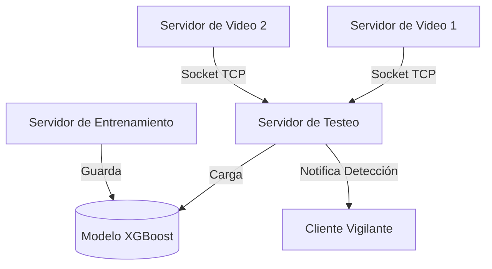

# Arquitectura del Sistema Distribuido

## Visión General

El sistema está diseñado para operar de manera distribuida, separando las responsabilidades de captura de video, procesamiento de inferencia, entrenamiento y monitoreo. El sistema utiliza **Sockets TCP** para la comunicación, evitando frameworks de alto nivel como HTTP/REST o Message Queues, cumpliendo con los requisitos de bajo nivel.

## Componentes

El sistema consta de cuatro componentes principales:

### 1. Servidor de Video (`src/video`)
*   **Rol**: Productor de datos.
*   **Función**: Captura frames de una fuente de video (cámara web o archivo de imagen estática en bucle).
*   **Comunicación**: Se conecta al **Servidor de Testeo**. Envía flujos de imágenes para ser analizadas.
*   **Protocolo**: Envía mensajes tipo `IMAGE_SEND`.

### 2. Servidor de Testeo (`src/testing`)
*   **Rol**: Procesador (Inferencia) y Hub.
*   **Función**:
    *   Actúa como servidor central para las cámaras (Servidores de Video) y los clientes de monitoreo (Watchman).
    *   Carga el modelo de IA entrenado (`src/training/model.py`).
    *   Recibe imágenes de las cámaras.
    *   Realiza la predicción (Inferencia) usando el modelo XGBoost.
    *   Si se detecta un objeto de interés, guarda el registro y notifica a los clientes conectados.
*   **Comunicación**: Escucha en el puerto `5003`.

### 3. Servidor de Entrenamiento (`src/training`)
*   **Rol**: Entrenador.
*   **Función**:
    *   Recibe datasets de imágenes etiquetadas.
    *   Entrena el modelo XGBoost.
    *   Guarda el modelo entrenado en disco para que el Servidor de Testeo lo recargue.
*   **Comunicación**: Escucha en el puerto `5002`.

### 4. Cliente Vigilante (Watchman) (`src/client`)
*   **Rol**: Consumidor de eventos.
*   **Función**:
    *   Se conecta al Servidor de Testeo.
    *   Recibe notificaciones en tiempo real (logs) de los objetos detectados.
    *   Muestra una tabla con: Tipo de objeto, Fecha, Hora y (opcionalmente) la imagen.
*   **Comunicación**: Se conecta al Servidor de Testeo.

## Diagrama de Despliegue Conceptual

## Concurrencia

El sistema hace uso intensivo de **Hilos (Threading)** para manejar múltiples conexiones simultáneas:
*   El Servidor de Testeo crea un hilo por cada cámara conectada y por cada cliente vigilante.
*   Esto asegura que el procesamiento de una cámara lenta no bloquee la recepción de datos de otras cámaras o el envío de alertas.
