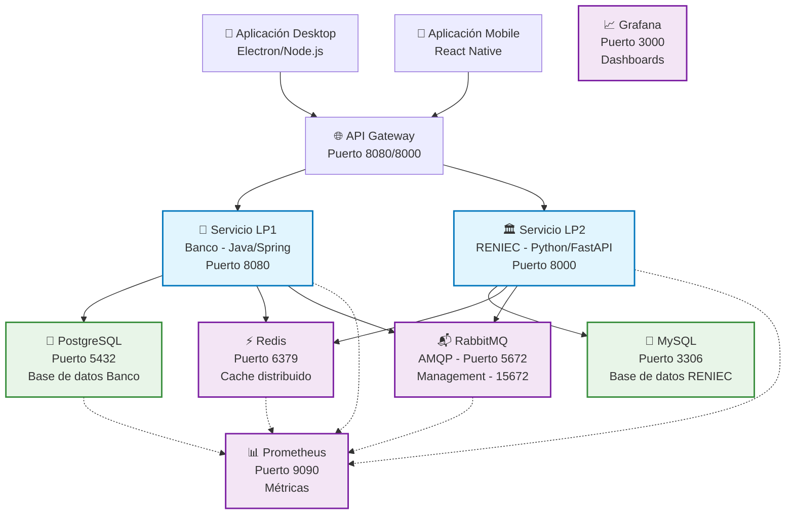
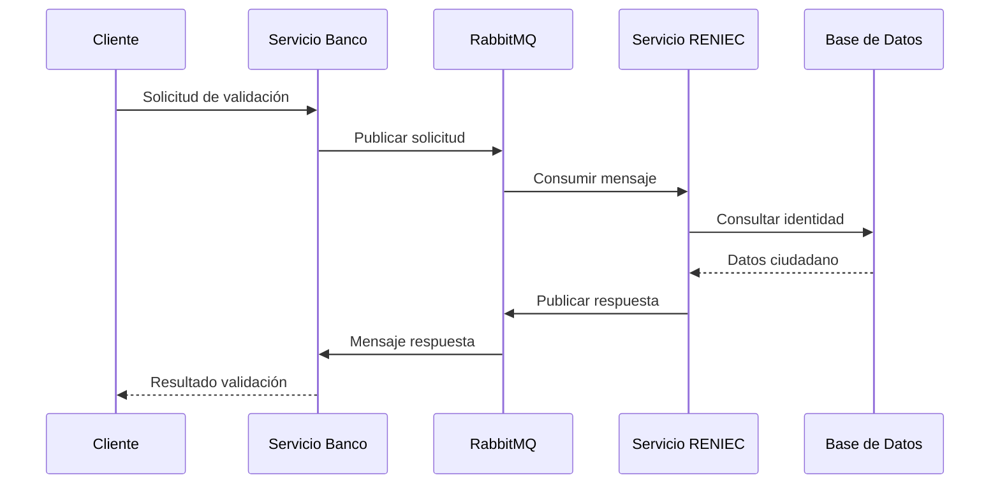
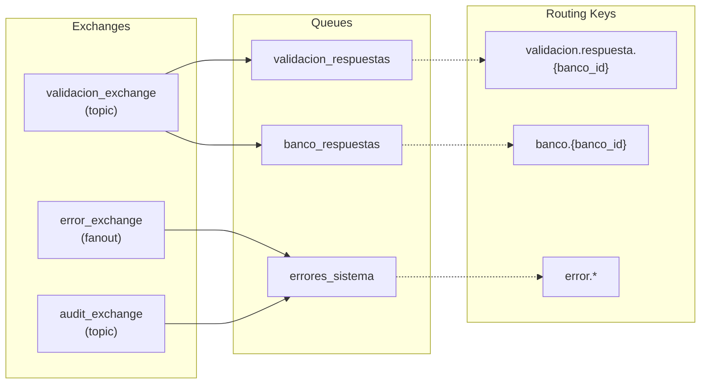

# Sistema Distribuido Shibasito

## 🏗️ Descripción General

El **Sistema Distribuido Shibasito** es una solución bancaria integral que implementa una arquitectura de microservicios para la validación de identidad y operaciones financieras. El sistema integra servicios bancarios (LP1), validación de documentos de identidad (LP2) y aplicaciones cliente para desktop y móvil.

## 🎯 Características Principales

### Servicios Core
- **Servicio LP1 (Banco)**: API REST en Java/Spring Boot para operaciones bancarias
- **Servicio LP2 (RENIEC)**: Servicio Python/FastAPI para validación de identidad
- **Sistema de Mensajería**: RabbitMQ para comunicación asíncrona entre servicios
- **Cache Distribuido**: Redis para optimización de rendimiento

### Aplicaciones Cliente
- **Aplicación Desktop**: Electron/JavaScript para gestión bancaria
- **Aplicación Mobile**: React Native para dispositivos móviles

### Infraestructura
- **Bases de Datos**: PostgreSQL (LP1) y MySQL (LP2)
- **Monitoreo**: Prometheus + Grafana para métricas y dashboards
- **Contenedores**: Docker + Docker Compose para orquestación

## 🏛️ Arquitectura del Sistema



## 🚀 Inicio Rápido

### Prerrequisitos

```bash
# Verificar versiones requeridas
docker --version  # Docker Engine 20.10+
docker-compose --version  # Docker Compose v2.0+
```

### Instalación Completa

```bash
# 1. Navegar al directorio del sistema
cd shibasito-sistema-distribuido/

# 2. Iniciar todos los servicios
./start-shibasito.sh

# 3. Verificar estado de los servicios
docker-compose -f docker-compose.main.yml ps
```

### Verificación del Sistema

```bash
# Health check general
./scripts/health-check.sh

# Ver logs en tiempo real
docker-compose -f docker-compose.main.yml logs -f

# Verificar conectividad de red
docker network ls
```

## 📋 Estado de Servicios

### Servicios de Aplicación
| Servicio | Puerto | Estado | Health Check |
|----------|--------|---------|--------------|
| Servicio LP1 (Banco) | 8080 | ✅ Activo | `/api/v1/health/` |
| Servicio LP2 (RENIEC) | 8000 | ✅ Activo | `/api/v1/health/` |

### Servicios de Infraestructura
| Servicio | Puerto | Estado | Credenciales |
|----------|--------|---------|--------------|
| PostgreSQL | 5432 | ✅ Activo | banco_user/banco_pass |
| MySQL | 3306 | ✅ Activo | reniec_user/reniec_pass |
| RabbitMQ | 5672/15672 | ✅ Activo | admin/admin123_secure_2024 |
| Redis | 6379 | ✅ Activo | N/A |
| Prometheus | 9090 | ✅ Activo | N/A |
| Grafana | 3000 | ✅ Activo | admin/admin123_secure_2024 |

### Interfaces Web Disponibles

```bash
# Dashboards de Monitoreo
🌐 Grafana: http://localhost:3000
📊 Prometheus: http://localhost:9090
📬 RabbitMQ Management: http://localhost:15672

# APIs de Servicios
🏦 API Banco LP1: http://localhost:8080/docs
🏛️ API RENIEC LP2: http://localhost:8000/docs
```

## 🗂️ Estructura del Proyecto

```
shibasito-sistema-distribuido/
├── 📂 aplicaciones-cliente-lp3/
│   ├── 📂 desktop-app/     # Aplicación Electron/Node.js
│   └── 📂 mobile-app/      # Aplicación React Native
├── 📂 docs/                # Documentación técnica
├── 📂 init-scripts/        # Scripts de inicialización
├── 📂 lp1-servicio-banco/  # Servicio Java/Spring Boot
├── 📂 lp2_reniec_service/  # Servicio Python/FastAPI
├── 📂 rabbitmq-config/     # Configuración RabbitMQ
├── 📂 redis-config/        # Configuración Redis
├── 📂 scripts/             # Scripts utilitarios
├── 📂 testing_system/      # Sistema de pruebas
├── 📂 config/              # Configuraciones adicionales
├── 📂 data/                # Datos persistentes
├── 📂 logs/                # Archivos de log
└── docker-compose.main.yml # Orquestación principal
```

## 🔧 Comandos Esenciales

### Gestión de Servicios

```bash
# Iniciar servicios específicos
docker-compose -f docker-compose.main.yml up -d servicio-banco-lp1 servicio-reniec-lp2

# Reiniciar un servicio
docker-compose -f docker-compose.main.yml restart servicio-banco-lp1

# Detener todos los servicios
docker-compose -f docker-compose.main.yml down

# Reiniciar y limpiar (⚠️ CUIDADO: Elimina datos)
docker-compose -f docker-compose.main.yml down -v
```

### Monitoreo y Logs

```bash
# Ver estado de todos los servicios
docker-compose -f docker-compose.main.yml ps

# Ver logs en tiempo real
docker-compose -f docker-compose.main.yml logs -f

# Ver logs de un servicio específico
docker-compose -f docker-compose.main.yml logs -f servicio-banco-lp1

# Monitorear uso de recursos
docker stats
```

### Diagnóstico

```bash
# Verificar conectividad de red
docker network ls
docker network inspect shibasito-sistema-distribuido_shibasito-network

# Conectar a bases de datos
docker-compose -f docker-compose.main.yml exec bd1_postgresql psql -U banco_user -d banco_db
docker-compose -f docker-compose.main.yml exec bd2_mysql mysql -u reniec_user -p reniec_db

# Ejecutar comandos en contenedores
docker-compose -f docker-compose.main.yml exec servicio-banco-lp1 bash
docker-compose -f docker-compose.main.yml exec servicio-reniec-lp2 bash
```

## 🔗 Flujo de Comunicación

### Validación de Identidad



### Arquitectura de Mensajería



## 📊 Monitoreo y Métricas

### Dashboards Disponibles

#### Grafana Dashboards
- **System Overview**: Métricas generales del sistema
- **Application Metrics**: Métricas de aplicaciones LP1/LP2
- **Database Performance**: Métricas de PostgreSQL y MySQL
- **Message Queue**: Métricas de RabbitMQ
- **Cache Performance**: Métricas de Redis

#### Prometheus Métricas Clave

```bash
# Métricas de aplicación
validaciones_procesadas_total
validaciones_exitosas_total
validaciones_fallidas_total
tiempo_consulta_promedio

# Métricas de infraestructura
rabbitmq_connections_total
redis_connected_clients
postgres_connections_active

# Métricas de sistema
container_cpu_usage_percent
container_memory_usage_bytes
```

### Alertas Configuradas

| Alerta | Condición | Severidad |
|--------|-----------|-----------|
| Servicio no disponible | Health check falla | Crítica |
| Alto uso de memoria | > 80% por 5 min | Alta |
| Tiempo de respuesta alto | > 2s promedio | Alta |
| Errores de validación | > 5% tasa | Media |

## 🔒 Seguridad

### Configuraciones de Seguridad

#### RabbitMQ
- **Autenticación**: Usuario y contraseña por defecto
- **Virtual Host**: Configurado para aislar entornos
- **Permissions**: Restricciones por usuario y vhost

#### Bases de Datos
- **PostgreSQL**: Usuario banco_user con permisos específicos
- **MySQL**: Usuario reniec_user con acceso limitado
- **Conexiones**: Pool de conexiones configurado

#### Aplicaciones
- **CORS**: Configurado para permitir orígenes específicos
- **Rate Limiting**: Límites configurados por endpoint
- **Logging**: Auditoría completa con filtrado de datos sensibles

### Recomendaciones de Producción

```bash
# 1. Cambiar credenciales por defecto
docker-compose -f docker-compose.main.yml exec rabbitmq rabbitmqctl change_password admin nueva_password

# 2. Configurar SSL/TLS
# Editar archivos de configuración en rabbitmq-config/

# 3. Restringir acceso a redes
# Configurar firewall rules para puertos específicos

# 4. Habilitar backup automático
./scripts/mysql-backup.sh
./scripts/postgres-backup.sh
```

## 🧪 Testing

### Sistema de Pruebas

El sistema incluye un framework completo de testing:

```bash
# Ejecutar todas las pruebas
./testing_system/run-all-tests.sh

# Pruebas específicas por servicio
./testing_system/test-lp1-service.sh
./testing_system/test-lp2-service.sh
./testing_system/test-integration.sh
```

### Tipos de Pruebas

1. **Unit Tests**: Pruebas individuales de componentes
2. **Integration Tests**: Pruebas de integración entre servicios
3. **End-to-End Tests**: Pruebas completas de flujo
4. **Load Tests**: Pruebas de rendimiento
5. **Security Tests**: Pruebas de seguridad

## 📈 Rendimiento

### Configuraciones Optimizadas

#### Bases de Datos
```sql
-- PostgreSQL
shared_buffers = 256MB
effective_cache_size = 1GB
max_connections = 100

-- MySQL
innodb_buffer_pool_size = 256M
max_connections = 100
```

#### Redis
```conf
maxmemory 512mb
maxmemory-policy allkeys-lru
```

#### RabbitMQ
```conf
vm_memory_high_watermark = 0.6
disk_free_limit = 1GB
```

### Métricas de Rendimiento

| Métrica | Objetivo | Alerta |
|---------|----------|--------|
| Tiempo de respuesta API | < 500ms | > 1s |
| Throughput validaciones | > 100/min | < 50/min |
| Disponibilidad | > 99.9% | < 99% |
| Uso CPU | < 70% | > 85% |
| Uso Memoria | < 80% | > 90% |

## 🛠️ Troubleshooting

### Problemas Comunes

#### 1. Servicios no inician
```bash
# Verificar logs detallados
docker-compose -f docker-compose.main.yml logs [servicio]

# Verificar conectividad
docker network inspect shibasito-sistema-distribuido_shibasito-network

# Verificar recursos del sistema
docker system df
docker system prune
```

#### 2. Errores de base de datos
```bash
# Verificar conexiones
docker-compose -f docker-compose.main.yml exec bd1_postgresql psql -U banco_user -d banco_db -c "SELECT 1;"
docker-compose -f docker-compose.main.yml exec bd2_mysql mysql -u reniec_user -p reniec_db -e "SELECT 1;"
```

#### 3. Problemas de red
```bash
# Verificar resolución DNS
docker-compose -f docker-compose.main.yml exec servicio-banco-lp1 ping servicio-reniec-lp2

# Verificar puertos
netstat -tulpn | grep :8080
```

#### 4. Alto uso de memoria
```bash
# Monitorear uso por contenedor
docker stats --no-stream

# Reducir recursos asignados
# Editar docker-compose.main.yml
```

## 📚 Documentación Adicional

- [📖 Manual de Instalación](installation-manual.md)
- [🏗️ Diagrama de Arquitectura](architecture_diagram.mmd)
- [🔗 Diagrama de Protocolo](protocol_diagram.mmd)
- [📡 Documentación de APIs](api-documentation.md)
- [🧪 Sistema de Pruebas](testing-documentation.md)
- [🚀 Guía de Despliegue](deployment-guide.md)

## 🤝 Contribución

### Guidelines de Desarrollo

1. **Branching Strategy**: Usar feature branches desde main
2. **Code Style**: Seguir guías de estilo para Java/Python/JavaScript
3. **Testing**: Todas las features deben incluir tests
4. **Documentation**: Actualizar documentación con cambios
5. **CI/CD**: Usar pipelines automatizados

### Pull Request Process

```bash
# 1. Crear feature branch
git checkout -b feature/nueva-funcionalidad

# 2. Implementar cambios
# Escribir código y tests

# 3. Ejecutar tests locales
./testing_system/run-all-tests.sh

# 4. Commit y push
git commit -m "feat: añadir nueva funcionalidad"
git push origin feature/nueva-funcionalidad

# 5. Crear Pull Request
```

## 📞 Soporte

### Canales de Soporte

- **Documentación**: Revisar archivos en `/docs/`
- **Logs**: Verificar en `/logs/` para diagnósticos
- **Health Checks**: Usar endpoints `/api/v1/health/`

### Contacto

- **Issues**: Crear issue en el repositorio
- **Emergencias**: Contactar equipo de desarrollo
- **Documentación**: Revisar guías en `/docs/`

---

## 📄 Licencia

Este proyecto está bajo la Licencia MIT. Ver [LICENSE](../LICENSE) para más detalles.

---

**Última actualización**: 30 de Octubre de 2025  
**Versión**: 1.0.0  
**Estado**: Producción Estable
