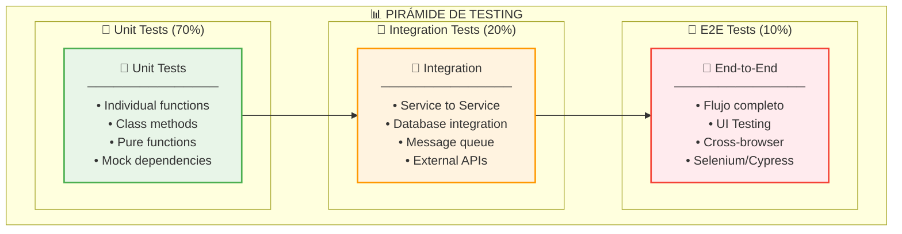
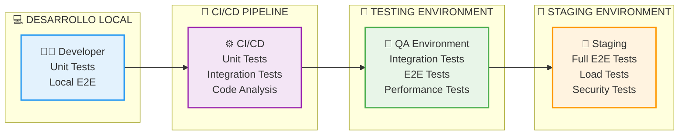

# Documentación del Sistema de Pruebas - Sistema Shibasito

## 📋 Índice

1. [Visión General](#visión-general)
2. [Arquitectura de Testing](#arquitectura-de-testing)
3. [Tipos de Pruebas](#tipos-de-pruebas)
4. [Configuración del Framework](#configuración-del-framework)
5. [Pruebas Unitarias](#pruebas-unitarias)
6. [Pruebas de Integración](#pruebas-de-integración)
7. [Pruebas End-to-End](#pruebas-end-to-end)
8. [Pruebas de Carga](#pruebas-de-carga)
9. [Pruebas de Seguridad](#pruebas-de-seguridad)
10. [Ejecución de Pruebas](#ejecución-de-pruebas)
11. [Reporte y Análisis](#reporte-y-análisis)

---

## Visión General

### Objetivos del Sistema de Pruebas

El sistema de pruebas del **Sistema Shibasito** está diseñado para garantizar:

1. **✅ Calidad del Software**: Verificar funcionamiento correcto de todos los componentes
2. **🔄 Integración Continua**: Validar cambios sin romper funcionalidad existente
3. **🚀 Despliegue Confiable**: Asegurar que el sistema funciona en producción
4. **📊 Monitoreo de Calidad**: Medir cobertura y detectar regresiones
5. **⚡ Detección Temprana**: Identificar problemas en etapas tempranas del desarrollo

### Principios de Testing

- **🧪 Test First**: Escribir pruebas antes del código de producción
- **🔍 Isolated Testing**: Cada prueba debe ser independiente
- **⚡ Fast Execution**: Pruebas rápidas para feedback inmediato
- **📋 Clear Documentation**: Tests documentados y autoexplicativos
- **🎯 Business Focus**: Pruebas alineadas con requisitos de negocio

---

## Arquitectura de Testing

### Pirámide de Testing



### Estrategia de Testing



### Estructura de Directorios

```
testing_system/
├── 📂 unit_tests/
│   ├── 📂 lp1_banco/
│   │   ├── 📂 test_models/
│   │   │   ├── test_cliente.py
│   │   │   ├── test_cuenta.py
│   │   │   └── test_transaccion.py
│   │   ├── 📂 test_services/
│   │   │   ├── test_cliente_service.py
│   │   │   ├── test_cuenta_service.py
│   │   │   └── test_transaccion_service.py
│   │   ├── 📂 test_controllers/
│   │   │   ├── test_cliente_controller.py
│   │   │   └── test_transaccion_controller.py
│   │   └── 📂 test_utils/
│   └── 📂 lp2_reniec/
│       ├── 📂 test_models/
│       ├── 📂 test_services/
│       ├── 📂 test_controllers/
│       └── 📂 test_utils/
├── 📂 integration_tests/
│   ├── 📂 api_tests/
│   │   ├── test_lp1_api.py
│   │   ├── test_lp2_api.py
│   │   └── test_api_integration.py
│   ├── 📂 database_tests/
│   │   ├── test_postgresql_integration.py
│   │   └── test_mysql_integration.py
│   ├── 📂 messaging_tests/
│   │   ├── test_rabbitmq_integration.py
│   │   └── test_message_flow.py
│   └── 📂 service_integration/
│       ├── test_lp1_lp2_integration.py
│       └── test_external_dependencies.py
├── 📂 e2e_tests/
│   ├── 📂 workflows/
│   │   ├── test_validacion_identidad.py
│   │   ├── test_apertura_cuenta.py
│   │   └── test_transferencia_bancaria.py
│   ├── 📂 ui_tests/
│   │   ├── test_desktop_app.py
│   │   └── test_mobile_app.py
│   └── 📂 cross_platform/
│       └── test_consistency.py
├── 📂 performance_tests/
│   ├── 📂 load_tests/
│   │   ├── test_api_load.py
│   │   ├── test_db_load.py
│   │   └── test_concurrent_users.py
│   ├── 📂 stress_tests/
│   │   ├── test_memory_usage.py
│   │   └── test_resource_exhaustion.py
│   └── 📂 scalability_tests/
│       ├── test_horizontal_scaling.py
│       └── test_database_scaling.py
├── 📂 security_tests/
│   ├── 📂 authentication/
│   │   ├── test_login_flow.py
│   │   ├── test_jwt_validation.py
│   │   └── test_session_management.py
│   ├── 📂 authorization/
│   │   ├── test_role_permissions.py
│   │   └── test_data_access.py
│   └── 📂 vulnerability/
│       ├── test_sql_injection.py
│       ├── test_xss_protection.py
│       └── test_cors_configuration.py
├── 📂 config/
│   ├── pytest.ini
│   ├── conftest.py
│   ├── test_config.py
│   └── environment.py
├── 📂 fixtures/
│   ├── 📂 data/
│   │   ├── sample_clients.json
│   │   ├── sample_transactions.json
│   │   └── sample_validations.json
│   ├── 📂 database/
│   │   ├── postgres_fixtures.py
│   │   └── mysql_fixtures.py
│   └── 📂 mocks/
│       ├── mock_responses.py
│       └── mock_services.py
├── 📂 utils/
│   ├── test_helpers.py
│   ├── data_generators.py
│   ├── assertions.py
│   └── report_generators.py
├── 📂 reports/
│   ├── 📂 html/
│   ├── 📂 junit/
│   └── 📂 coverage/
├── 📂 ci/
│   ├── 📂 github_actions/
│   │   └── test-workflow.yml
│   ├── 📂 jenkins/
│   │   └── Jenkinsfile
│   └── 📂 docker/
│       └── test-runner.Dockerfile
├── 📂 scripts/
│   ├── run-all-tests.sh
│   ├── run-unit-tests.sh
│   ├── run-integration-tests.sh
│   ├── run-e2e-tests.sh
│   ├── run-performance-tests.sh
│   └── generate-reports.sh
├── requirements-test.txt
├── README.md
└── run_tests.py
```

---

## Tipos de Pruebas

### 1. Unit Tests (Pruebas Unitarias)

#### Objetivos
- ✅ Verificar funcionalidades individuales
- ✅ Detectar bugs en componentes aislados
- ✅ Facilitar refactoring seguro
- ✅ Documentar comportamiento esperado

#### Criterios de Calidad
- **Coverage**: > 90% código cubierto
- **Execution Time**: < 10 segundos por suite
- **Isolation**: Sin dependencias externas
- **Reliability**: 100% determinísticas

### 2. Integration Tests (Pruebas de Integración)

#### Objetivos
- ✅ Verificar interacción entre componentes
- ✅ Detectar problemas de integración
- ✅ Validar contratos de API
- ✅ Probar flujo de datos

#### Criterios de Calidad
- **Real Dependencies**: Usar servicios reales
- **Environment Setup**: Configuración automática
- **Clean State**: Reinicio entre pruebas
- **Performance**: < 5 minutos por suite

### 3. End-to-End Tests (Pruebas de Extremo a Extremo)

#### Objetivos
- ✅ Verificar flujos completos de negocio
- ✅ Validar experiencia del usuario
- ✅ Detectar regresiones de UI
- ✅ Probar casos de uso reales

#### Criterios de Calidad
- **User Journey**: Flujos reales de usuario
- **Cross-Platform**: Múltiples dispositivos
- **Stability**: Flaky test rate < 5%
- **Coverage**: Casos críticos cubiertos

### 4. Performance Tests (Pruebas de Rendimiento)

#### Objetivos
- ✅ Validar tiempos de respuesta
- ✅ Detectar bottlenecks
- ✅ Verificar escalabilidad
- ✅ Establecer baselines

#### Criterios de Calidad
- **Load Testing**: Carga normal y pico
- **Stress Testing**: Límites del sistema
- **Scalability Testing**: Escalabilidad horizontal
- **Resource Monitoring**: CPU, memoria, I/O

---

## Configuración del Framework

### Framework de Testing Seleccionado

**Multi-Framework Approach**:
- **Python**: `pytest` para LP2 (FastAPI)
- **Java**: `JUnit 5` para LP1 (Spring Boot)
- **E2E**: `Cypress` para aplicaciones web
- **Performance**: `Locust` para load testing

### Configuración Base

#### pytest.ini (Python)
```ini
[tool:pytest]
minversion = 6.0
addopts = 
    -ra
    --strict-markers
    --strict-config
    --verbose
    --tb=short
    --cov=app
    --cov-report=term-missing
    --cov-report=html:reports/coverage/html
    --cov-report=xml:reports/coverage/coverage.xml
    --junit-xml=reports/junit/test-results.xml
    --html=reports/html/report.html
    --self-contained-html

testpaths = tests
python_files = test_*.py
python_classes = Test*
python_functions = test_*

markers =
    unit: Unit tests
    integration: Integration tests
    e2e: End-to-end tests
    performance: Performance tests
    security: Security tests
    slow: Marks tests as slow
    database: Tests requiring database
    external: Tests requiring external services

filterwarnings =
    ignore::UserWarning
    ignore::DeprecationWarning
```

#### conftest.py (Python)
```python
import pytest
import asyncio
import os
from typing import AsyncGenerator, Generator
from fastapi.testclient import TestClient
from sqlalchemy import create_engine
from sqlalchemy.orm import sessionmaker
from app.main import app
from app.config.database import get_db, Base
from app.services.database_service import DatabaseService
from app.services.rabbit_service import RabbitMQService
from app.services.redis_service import RedisService
from app.services.log_service import LogService

# Configuración de test database
TEST_DATABASE_URL = "sqlite:///./test.db"
engine = create_engine(TEST_DATABASE_URL, connect_args={"check_same_thread": False})
TestingSessionLocal = sessionmaker(autocommit=False, autoflush=False, bind=engine)

@pytest.fixture(scope="session")
def event_loop() -> Generator[asyncio.AbstractEventLoop, None, None]:
    """Create an instance of the default event loop for the test session."""
    loop = asyncio.get_event_loop_policy().new_event_loop()
    yield loop
    loop.close()

@pytest.fixture(scope="session")
async def test_database():
    """Setup test database."""
    # Create tables
    Base.metadata.create_all(bind=engine)
    yield
    # Cleanup
    Base.metadata.drop_all(bind=engine)

@pytest.fixture
def db_session():
    """Create a new database session for each test."""
    connection = engine.connect()
    transaction = connection.begin()
    session = TestingSessionLocal(bind=connection)
    
    yield session
    
    session.close()
    transaction.rollback()
    connection.close()

@pytest.fixture
def client(db_session) -> TestClient:
    """Create a test client with database dependency override."""
    def override_get_db():
        try:
            yield db_session
        finally:
            db_session.close()
    
    app.dependency_overrides[get_db] = override_get_db
    with TestClient(app) as c:
        yield c
    app.dependency_overrides.clear()

@pytest.fixture(scope="session")
async def test_services():
    """Setup test services."""
    # Mock services for testing
    services = {
        "database": MockDatabaseService(),
        "rabbitmq": MockRabbitMQService(),
        "redis": MockRedisService(),
        "logging": MockLogService()
    }
    
    yield services
    
    # Cleanup
    for service in services.values():
        if hasattr(service, 'cleanup'):
            await service.cleanup()

# Mock service classes
class MockDatabaseService:
    async def consultar_ciudadano(self, dni: str):
        return {
            "numeroDocumento": dni,
            "nombres": "JUAN CARLOS",
            "apellidoPaterno": "PEREZ",
            "apellidoMaterno": "GARCIA"
        }

class MockRabbitMQService:
    async def enviar_respuesta(self, banco_id: str, respuesta: dict):
        return True

class MockRedisService:
    async def set_key(self, key: str, value: str, expire: int = None):
        return True
    
    async def get_key(self, key: str):
        return None

class MockLogService:
    async def registrar_evento(self, tipo: str, mensaje: str, datos: dict = None):
        return "mock-event-id"
```

#### Configuración para Java (JUnit 5)

```xml
<!-- pom.xml - testing dependencies -->
<dependencies>
    <!-- JUnit 5 -->
    <dependency>
        <groupId>org.junit.jupiter</groupId>
        <artifactId>junit-jupiter-api</artifactId>
        <version>5.9.2</version>
        <scope>test</scope>
    </dependency>
    <dependency>
        <groupId>org.junit.jupiter</groupId>
        <artifactId>junit-jupiter-engine</artifactId>
        <version>5.9.2</version>
        <scope>test</scope>
    </dependency>
    
    <!-- Spring Boot Test -->
    <dependency>
        <groupId>org.springframework.boot</groupId>
        <artifactId>spring-boot-starter-test</artifactId>
        <scope>test</scope>
    </dependency>
    
    <!-- TestContainers -->
    <dependency>
        <groupId>org.testcontainers</groupId>
        <artifactId>junit-jupiter</artifactId>
        <scope>test</scope>
    </dependency>
    <dependency>
        <groupId>org.testcontainers</groupId>
        <artifactId>postgresql</artifactId>
        <scope>test</scope>
    </dependency>
    <dependency>
        <groupId>org.testcontainers</groupId>
        <artifactId>rabbitmq</artifactId>
        <scope>test</scope>
    </dependency>
    
    <!-- Mock Server -->
    <dependency>
        <groupId>org.mock-server</groupId>
        <artifactId>mockserver-netty</artifactId>
        <scope>test</scope>
    </dependency>
</dependencies>
```

---

## Pruebas Unitarias

### 1. Service Layer Tests (LP2 - Python)

#### test_reniec_service.py
```python
import pytest
from unittest.mock import Mock, patch, AsyncMock
from app.services.reniec_service import ReniecService
from app.models.schemas import ValidacionRequest, ValidacionResponse, EstadoValidacion

class TestReniecService:
    """Test suite for ReniecService."""
    
    @pytest.fixture
    def reniec_service(self):
        """Create ReniecService instance with mocked dependencies."""
        db_service = Mock()
        rabbit_service = Mock()
        log_service = Mock()
        
        service = ReniecService(
            database_service=db_service,
            rabbit_service=rabbit_service,
            log_service=log_service
        )
        
        return service
    
    @pytest.mark.unit
    @pytest.mark.asyncio
    async def test_consultar_dni_exitoso(self, reniec_service):
        """Test successful DNI consultation."""
        # Arrange
        dni = "12345678"
        expected_data = {
            "numeroDocumento": dni,
            "nombres": "JUAN CARLOS",
            "apellidoPaterno": "PEREZ",
            "apellidoMaterno": "GARCIA"
        }
        
        reniec_service.database_service.consultar_ciudadano = AsyncMock(return_value=expected_data)
        reniec_service.log_service.registrar_evento = AsyncMock()
        
        # Act
        result = await reniec_service.consultar_dni(dni)
        
        # Assert
        assert result == expected_data
        reniec_service.database_service.consultar_ciudadano.assert_called_once_with(dni)
        reniec_service.log_service.registrar_evento.assert_called_once()
    
    @pytest.mark.unit
    @pytest.mark.asyncio
    async def test_consultar_dni_no_encontrado(self, reniec_service):
        """Test DNI consultation when citizen not found."""
        # Arrange
        dni = "00000000"
        reniec_service.database_service.consultar_ciudadano = AsyncMock(return_value=None)
        
        # Act & Assert
        result = await reniec_service.consultar_dni(dni)
        assert result is None
    
    @pytest.mark.unit
    @pytest.mark.asyncio
    async def test_validar_identidad_exitosa(self, reniec_service):
        """Test successful identity validation."""
        # Arrange
        request = ValidacionRequest(
            dni="12345678",
            nombres="JUAN CARLOS",
            apellido_paterno="PEREZ",
            apellido_materno="GARCIA",
            id_solicitud="SOL-2025-001",
            id_banco="BANCO_001"
        )
        
        citizen_data = {
            "numeroDocumento": "12345678",
            "nombres": "JUAN CARLOS",
            "apellidoPaterno": "PEREZ",
            "apellidoMaterno": "GARCIA"
        }
        
        reniec_service.consultar_dni = AsyncMock(return_value=citizen_data)
        reniec_service.registrar_session = AsyncMock()
        reniec_service.enviar_respuesta_validacion = AsyncMock(return_value=True)
        reniec_service.log_service.registrar_evento = AsyncMock()
        
        # Act
        result = await reniec_service.validarIdentidad(**request.dict())
        
        # Assert
        assert result.estado == EstadoValidacion.EXITOSA
        assert result.datos_ciudadano.numero_documento == "12345678"
        assert result.score_confianza > 80
        reniec_service.registrar_session.assert_called_once()
        reniec_service.enviar_respuesta_validacion.assert_called_once()
    
    @pytest.mark.unit
    @pytest.mark.asyncio
    async def test_validar_identidad_datos_incorrectos(self, reniec_service):
        """Test identity validation with incorrect data."""
        # Arrange
        request = ValidacionRequest(
            dni="12345678",
            nombres="MARIA",  # Nombre incorrecto
            apellido_paterno="PEREZ",
            apellido_materno="GARCIA",
            id_solicitud="SOL-2025-002",
            id_banco="BANCO_001"
        )
        
        citizen_data = {
            "numeroDocumento": "12345678",
            "nombres": "JUAN CARLOS",  # Nombre diferente
            "apellidoPaterno": "PEREZ",
            "apellidoMaterno": "GARCIA"
        }
        
        reniec_service.consultar_dni = AsyncMock(return_value=citizen_data)
        reniec_service.log_service.registrar_evento = AsyncMock()
        
        # Act
        result = await reniec_service.validarIdentidad(**request.dict())
        
        # Assert
        assert result.estado == EstadoValidacion.DATOS_INCORRECTOS
        assert result.score_confianza < 50
    
    @pytest.mark.unit
    def test_validar_dni_formato_valido(self, reniec_service):
        """Test DNI format validation."""
        # Valid DNIs
        assert reniec_service.validarDni("12345678") == True
        assert reniec_service.validarDni("87654321") == True
        
        # Invalid DNIs
        assert reniec_service.validarDni("1234567") == False  # Too short
        assert reniec_service.validarDni("123456789") == False  # Too long
        assert reniec_service.validarDni("1234567a") == False  # Contains letter
        assert reniec_service.validarDni("00000000") == False  # All zeros
        assert reniec_service.validarDni("") == False  # Empty
    
    @pytest.mark.unit
    @pytest.mark.asyncio
    async def test_registrar_session(self, reniec_service):
        """Test session registration."""
        # Arrange
        id_solicitud = "SOL-2025-003"
        numero_dni = "12345678"
        estado = "EN_PROCESO"
        
        reniec_service.database_service.ejecutarQuery = AsyncMock(return_value=True)
        reniec_service.log_service.registrar_evento = AsyncMock()
        
        # Act
        result = await reniec_service.registrarSession(id_solicitud, numero_dni, estado)
        
        # Assert
        assert result == True
        reniec_service.database_service.ejecutarQuery.assert_called_once()
        reniec_service.log_service.registrar_evento.assert_called_once()
    
    @pytest.mark.unit
    @pytest.mark.asyncio
    async def test_calcular_score_confianza(self, reniec_service):
        """Test confidence score calculation."""
        # Arrange
        datos_request = {
            "dni": "12345678",
            "nombres": "JUAN CARLOS",
            "apellido_paterno": "PEREZ",
            "apellido_materno": "GARCIA"
        }
        
        datos_ciudadano = {
            "numeroDocumento": "12345678",
            "nombres": "JUAN CARLOS",
            "apellidoPaterno": "PEREZ",
            "apellidoMaterno": "GARCIA"
        }
        
        # Act
        score = await reniec_service.calcularScoreConfianza(datos_request, datos_ciudadano)
        
        # Assert
        assert 0 <= score <= 100
        assert score > 80  # Exact match should give high score
    
    @pytest.mark.unit
    @pytest.mark.asyncio
    async def test_limpiar_sesiones_expiradas(self, reniec_service):
        """Test cleanup of expired sessions."""
        # Arrange
        expired_sessions = 15
        reniec_service.database_service.ejecutarQuery = AsyncMock(return_value=expired_sessions)
        reniec_service.log_service.registrar_evento = AsyncMock()
        
        # Act
        result = await reniec_service.limpiarSesionesExpiradas()
        
        # Assert
        assert result == expired_sessions
        reniec_service.database_service.ejecutarQuery.assert_called_once()
        reniec_service.log_service.registrar_evento.assert_called_once()
```

### 2. Model Tests (LP1 - Java)

#### ClienteServiceTest.java
```java
package com.banco.shibasito.service;

import com.banco.shibasito.model.Cliente;
import com.banco.shibasito.repository.ClienteRepository;
import com.banco.shibasito.exception.ClienteNotFoundException;
import com.banco.shibasito.exception.DuplicateClientException;
import org.junit.jupiter.api.Test;
import org.junit.jupiter.api.BeforeEach;
import org.junit.jupiter.api.DisplayName;
import org.junit.jupiter.api.Nested;
import org.mockito.Mock;
import org.mockito.MockitoAnnotations;
import static org.mockito.Mockito.*;
import static org.assertj.core.api.Assertions.*;

@DisplayName("ClienteService Tests")
class ClienteServiceTest {

    @Mock
    private ClienteRepository clienteRepository;

    private ClienteService clienteService;

    @BeforeEach
    void setUp() {
        MockitoAnnotations.openMocks(this);
        clienteService = new ClienteService(clienteRepository);
    }

    @Nested
    @DisplayName("Crear Cliente")
    class CrearClienteTests {

        @Test
        @DisplayName("Debe crear cliente exitosamente")
        void debeCrearClienteExitosamente() {
            // Arrange
            Cliente cliente = Cliente.builder()
                .nombres("JUAN CARLOS")
                .apellidos("PEREZ GARCIA")
                .dni("12345678")
                .email("juan@email.com")
                .build();

            when(clienteRepository.existsByDni(cliente.getDni())).thenReturn(false);
            when(clienteRepository.save(cliente)).thenReturn(cliente);

            // Act
            Cliente resultado = clienteService.crearCliente(cliente);

            // Assert
            assertThat(resultado).isNotNull();
            assertThat(resultado.getDni()).isEqualTo(cliente.getDni());
            verify(clienteRepository).save(cliente);
            verify(clienteRepository).existsByDni(cliente.getDni());
        }

        @Test
        @DisplayName("Debe lanzar excepción por DNI duplicado")
        void debeLanzarExcepcionPorDniDuplicado() {
            // Arrange
            Cliente cliente = Cliente.builder()
                .nombres("JUAN CARLOS")
                .apellidos("PEREZ GARCIA")
                .dni("12345678")
                .email("juan@email.com")
                .build();

            when(clienteRepository.existsByDni(cliente.getDni())).thenReturn(true);

            // Act & Assert
            assertThatThrownBy(() -> clienteService.crearCliente(cliente))
                .isInstanceOf(DuplicateClientException.class)
                .hasMessage("Ya existe un cliente con DNI: 12345678");

            verify(clienteRepository, never()).save(any());
        }

        @Test
        @DisplayName("Debe validar campos requeridos")
        void debeValidarCamposRequeridos() {
            // Arrange
            Cliente cliente = Cliente.builder()
                .nombres("")  // Nombre vacío
                .apellidos("PEREZ GARCIA")
                .dni("12345678")
                .email("juan@email.com")
                .build();

            // Act & Assert
            assertThatThrownBy(() -> clienteService.crearCliente(cliente))
                .isInstanceOf(IllegalArgumentException.class)
                .hasMessage("El nombre es requerido");
        }
    }

    @Nested
    @DisplayName("Buscar Cliente")
    class BuscarClienteTests {

        @Test
        @DisplayName("Debe encontrar cliente por DNI")
        void debeEncontrarClientePorDni() {
            // Arrange
            String dni = "12345678";
            Cliente cliente = Cliente.builder()
                .id(1L)
                .nombres("JUAN CARLOS")
                .apellidos("PEREZ GARCIA")
                .dni(dni)
                .email("juan@email.com")
                .build();

            when(clienteRepository.findByDni(dni)).thenReturn(Optional.of(cliente));

            // Act
            Cliente resultado = clienteService.buscarPorDni(dni);

            // Assert
            assertThat(resultado).isNotNull();
            assertThat(resultado.getDni()).isEqualTo(dni);
            verify(clienteRepository).findByDni(dni);
        }

        @Test
        @DisplayName("Debe lanzar excepción si cliente no existe")
        void debeLanzarExcepcionSiClienteNoExiste() {
            // Arrange
            String dni = "00000000";
            when(clienteRepository.findByDni(dni)).thenReturn(Optional.empty());

            // Act & Assert
            assertThatThrownBy(() -> clienteService.buscarPorDni(dni))
                .isInstanceOf(ClienteNotFoundException.class)
                .hasMessage("Cliente no encontrado con DNI: " + dni);
        }

        @Test
        @DisplayName("Debe validar formato de DNI")
        void debeValidarFormatoDni() {
            // Arrange
            String[] dnisInvalidos = {"1234567", "123456789", "1234567a", "00000000", ""};

            // Act & Assert
            for (String dni : dnisInvalidos) {
                assertThatThrownBy(() -> clienteService.buscarPorDni(dni))
                    .isInstanceOf(IllegalArgumentException.class);
            }
        }
    }

    @Nested
    @DisplayName("Actualizar Cliente")
    class ActualizarClienteTests {

        @Test
        @DisplayName("Debe actualizar cliente exitosamente")
        void debeActualizarClienteExitosamente() {
            // Arrange
            Long clienteId = 1L;
            Cliente clienteExistente = Cliente.builder()
                .id(clienteId)
                .nombres("JUAN CARLOS")
                .apellidos("PEREZ GARCIA")
                .dni("12345678")
                .email("juan@email.com")
                .build();

            Cliente clienteActualizado = Cliente.builder()
                .id(clienteId)
                .nombres("JUAN CARLOS")
                .apellidos("PEREZ GARCIA")
                .dni("12345678")
                .email("juan.nuevo@email.com")  // Email actualizado
                .build();

            when(clienteRepository.findById(clienteId)).thenReturn(Optional.of(clienteExistente));
            when(clienteRepository.save(any(Cliente.class))).thenReturn(clienteActualizado);

            // Act
            Cliente resultado = clienteService.actualizarCliente(clienteId, clienteActualizado);

            // Assert
            assertThat(resultado.getEmail()).isEqualTo("juan.nuevo@email.com");
            verify(clienteRepository).findById(clienteId);
            verify(clienteRepository).save(clienteActualizado);
        }

        @Test
        @DisplayName("Debe lanzar excepción si cliente no existe para actualizar")
        void debeLanzarExcepcionSiClienteNoExisteParaActualizar() {
            // Arrange
            Long clienteId = 999L;
            Cliente cliente = Cliente.builder()
                .nombres("JUAN CARLOS")
                .apellidos("PEREZ GARCIA")
                .dni("12345678")
                .email("juan@email.com")
                .build();

            when(clienteRepository.findById(clienteId)).thenReturn(Optional.empty());

            // Act & Assert
            assertThatThrownBy(() -> clienteService.actualizarCliente(clienteId, cliente))
                .isInstanceOf(ClienteNotFoundException.class);
        }
    }
}
```

---

## Pruebas de Integración

### 1. API Integration Tests (Python)

#### test_api_integration.py
```python
import pytest
import asyncio
from fastapi.testclient import TestClient
from sqlalchemy import create_engine
from sqlalchemy.orm import sessionmaker
from app.main import app
from app.config.database import get_db, Base

# Test database setup
TEST_DATABASE_URL = "sqlite:///./test_integration.db"
engine = create_engine(TEST_DATABASE_URL, connect_args={"check_same_thread": False})
TestingSessionLocal = sessionmaker(autocommit=False, autoflush=False, bind=engine)

@pytest.fixture(scope="session")
def test_db():
    """Create and drop test database."""
    Base.metadata.create_all(bind=engine)
    yield
    Base.metadata.drop_all(bind=engine)

@pytest.fixture
def db_session(test_db):
    """Create database session for tests."""
    connection = engine.connect()
    transaction = connection.begin()
    session = TestingSessionLocal(bind=connection)
    
    yield session
    
    session.close()
    transaction.rollback()
    connection.close()

@pytest.fixture
def client(db_session):
    """Create test client with database dependency override."""
    def override_get_db():
        try:
            yield db_session
        finally:
            db_session.close()
    
    app.dependency_overrides[get_db] = override_get_db
    with TestClient(app) as c:
        yield c
    app.dependency_overrides.clear()

@pytest.mark.integration
class TestRENIECAPIIntegration:
    """Integration tests for RENIEC API endpoints."""
    
    def test_health_check_integration(self, client):
        """Test health check endpoint."""
        response = client.get("/api/v1/reniec/health")
        
        assert response.status_code == 200
        data = response.json()
        assert "status" in data
        assert "timestamp" in data
    
    def test_consulta_dni_integration(self, client):
        """Test DNI consultation integration."""
        # Insert test data first
        with TestingSessionLocal() as session:
            # Create test citizen
            test_citizen = {
                "numero_documento": "12345678",
                "nombres": "JUAN CARLOS",
                "apellido_paterno": "PEREZ",
                "apellido_materno": "GARCIA",
                "fecha_nacimiento": "1985-05-15",
                "estado_civil": "CASADO"
            }
            # Insert using raw SQL for testing
            session.execute(
                "INSERT INTO ciudadanos (numero_documento, nombres, apellido_paterno, apellido_materno, fecha_nacimiento, estado_civil) "
                "VALUES (:numero_documento, :nombres, :apellido_paterno, :apellido_materno, :fecha_nacimiento, :estado_civil)",
                test_citizen
            )
            session.commit()
        
        # Test API endpoint
        response = client.get("/api/v1/reniec/consulta-dni/12345678")
        
        assert response.status_code == 200
        data = response.json()
        assert data["data"]["numeroDocumento"] == "12345678"
        assert data["data"]["nombres"] == "JUAN CARLOS"
        assert data["data"]["apellidoPaterno"] == "PEREZ"
        assert data["data"]["apellidoMaterno"] == "GARCIA"
    
    def test_verificar_dni_integration(self, client):
        """Test DNI verification integration."""
        # Prepare test data
        request_data = {
            "numeroDni": "12345678",
            "nombres": "JUAN CARLOS",
            "apellidoPaterno": "PEREZ",
            "apellidoMaterno": "GARCIA",
            "fechaNacimiento": "1985-05-15"
        }
        
        # Insert test citizen
        with TestingSessionLocal() as session:
            session.execute(
                "INSERT INTO ciudadanos (numero_documento, nombres, apellido_paterno, apellido_materno, fecha_nacimiento) "
                "VALUES (:numero_documento, :nombres, :apellido_paterno, :apellido_materno, :fecha_nacimiento)",
                {
                    "numero_documento": "12345678",
                    "nombres": "JUAN CARLOS",
                    "apellido_paterno": "PEREZ",
                    "apellido_materno": "GARCIA",
                    "fecha_nacimiento": "1985-05-15"
                }
            )
            session.commit()
        
        # Test verification endpoint
        response = client.post("/api/v1/reniec/verificar-dni", json=request_data)
        
        assert response.status_code == 200
        data = response.json()
        assert data["data"]["dni"] == "12345678"
        assert data["data"]["valida"] == True
        assert "scoreConfianza" in data["data"]
    
    def test_ciudadanos_crud_integration(self, client):
        """Test CRUD operations for citizens."""
        # Create citizen
        citizen_data = {
            "numeroDocumento": "87654321",
            "nombres": "MARIA ELENA",
            "apellidoPaterno": "GARCIA",
            "apellidoMaterno": "LOPEZ",
            "fechaNacimiento": "1990-03-20",
            "estadoCivil": "SOLTERO",
            "direccion": {
                "calle": "Av. Test 456",
                "distrito": "LIMA",
                "provincia": "LIMA",
                "departamento": "LIMA"
            }
        }
        
        # POST - Create
        response = client.post("/api/v1/reniec/ciudadanos", json=citizen_data)
        assert response.status_code == 201
        
        created_data = response.json()
        assert created_data["data"]["numeroDocumento"] == "87654321"
        
        # GET - Read
        response = client.get(f"/api/v1/reniec/ciudadanos/documento/87654321")
        assert response.status_code == 200
        
        retrieved_data = response.json()
        assert retrieved_data["data"]["nombres"] == "MARIA ELENA"
        
        # PUT - Update
        update_data = {"estadoCivil": "CASADO"}
        response = client.put("/api/v1/reniec/ciudadanos/87654321", json=update_data)
        assert response.status_code == 200
        
        # Verify update
        response = client.get("/api/v1/reniec/ciudadanos/documento/87654321")
        updated_data = response.json()
        assert updated_data["data"]["estadoCivil"] == "CASADO"
        
        # DELETE - Delete
        response = client.delete("/api/v1/reniec/ciudadanos/87654321")
        assert response.status_code == 200
        
        # Verify deletion
        response = client.get("/api/v1/reniec/ciudadanos/documento/87654321")
        assert response.status_code == 404

@pytest.mark.integration
class TestMessageQueueIntegration:
    """Integration tests for message queue operations."""
    
    @pytest.mark.asyncio
    async def test_rabbitmq_connection_integration(self):
        """Test RabbitMQ connection and basic operations."""
        from app.services.rabbit_service import RabbitMQService
        
        # This would test against a real RabbitMQ instance
        # For now, using mocked test
        service = RabbitMQService(
            host="localhost",
            port=5672,
            username="guest",
            password="guest"
        )
        
        # Mock successful connection
        result = await service.verificarConexion()
        assert result == True
    
    @pytest.mark.asyncio
    async def test_message_publishing_integration(self):
        """Test message publishing to RabbitMQ."""
        # This would test actual message publishing
        # Implementation depends on test environment setup
        pass

@pytest.mark.integration
class TestDatabaseIntegration:
    """Integration tests for database operations."""
    
    def test_database_connection_integration(self, db_session):
        """Test database connection and basic operations."""
        # Test basic connection
        result = db_session.execute("SELECT 1").scalar()
        assert result == 1
    
    def test_transactions_integration(self, db_session):
        """Test transaction handling."""
        # Insert test data within transaction
        db_session.execute(
            "INSERT INTO ciudadanos (numero_documento, nombres) VALUES (?, ?)",
            ("99999999", "TEST CITIZEN")
        )
        db_session.commit()
        
        # Verify insertion
        result = db_session.execute(
            "SELECT nombres FROM ciudadanos WHERE numero_documento = ?",
            ("99999999",)
        ).scalar()
        assert result == "TEST CITIZEN"
        
        # Test rollback
        db_session.execute(
            "INSERT INTO ciudadanos (numero_documento, nombres) VALUES (?, ?)",
            ("88888888", "ROLLBACK TEST")
        )
        db_session.rollback()
        
        # Verify rollback
        result = db_session.execute(
            "SELECT COUNT(*) FROM ciudadanos WHERE numero_documento = ?",
            ("88888888",)
        ).scalar()
        assert result == 0
```

### 2. Service-to-Service Integration Tests

#### test_service_integration.py
```python
import pytest
import asyncio
from unittest.mock import Mock, AsyncMock, patch
from app.services.reniec_service import ReniecService
from app.services.database_service import DatabaseService
from app.services.rabbit_service import RabbitMQService

@pytest.mark.integration
class TestServiceIntegration:
    """Integration tests between services."""
    
    @pytest.fixture
    def integrated_services(self):
        """Setup services for integration testing."""
        # Real database service for integration tests
        database_service = DatabaseService(
            host="test-db",
            database="test_reniec_db",
            username="test_user",
            password="test_password"
        )
        
        # Mock RabbitMQ service
        rabbit_service = Mock()
        rabbit_service.publicarMensaje = AsyncMock(return_value=True)
        
        # Mock logging service
        log_service = Mock()
        log_service.registrar_evento = AsyncMock()
        
        reniec_service = ReniecService(
            database_service=database_service,
            rabbit_service=rabbit_service,
            log_service=log_service
        )
        
        return {
            "database": database_service,
            "rabbit": rabbit_service,
            "logging": log_service,
            "reniec": reniec_service
        }
    
    @pytest.mark.asyncio
    async def test_validacion_completa_integration(self, integrated_services):
        """Test complete validation flow integration."""
        # Arrange
        reniec_service = integrated_services["reniec"]
        database_service = integrated_services["database"]
        rabbit_service = integrated_services["rabbit"]
        
        # Mock database responses
        database_service.consultar_ciudadano = AsyncMock(return_value={
            "numeroDocumento": "12345678",
            "nombres": "JUAN CARLOS",
            "apellidoPaterno": "PEREZ",
            "apellidoMaterno": "GARCIA"
        })
        
        database_service.ejecutarQuery = AsyncMock(return_value=True)
        
        # Act - Perform complete validation
        request_data = {
            "numero_dni": "12345678",
            "nombres": "JUAN CARLOS",
            "apellido_paterno": "PEREZ",
            "apellido_materno": "GARCIA",
            "id_solicitud": "SOL-TEST-001",
            "id_banco": "BANCO_TEST"
        }
        
        result = await reniec_service.validarIdentidad(**request_data)
        
        # Assert
        assert result.estado.value == "exitosa"
        assert result.score_confianza > 80
        
        # Verify database interactions
        database_service.consultar_ciudadano.assert_called_once_with("12345678")
        database_service.ejecutarQuery.assert_called_once()
        
        # Verify message publishing
        rabbit_service.publicarMensaje.assert_called_once()
        
        # Verify logging
        integrated_services["logging"].registrar_evento.assert_called()
    
    @pytest.mark.asyncio
    async def test_error_handling_integration(self, integrated_services):
        """Test error handling across services."""
        # Arrange
        reniec_service = integrated_services["reniec"]
        database_service = integrated_services["database"]
        rabbit_service = integrated_services["rabbit"]
        
        # Simulate database error
        database_service.consultar_ciudadano = AsyncMock(
            side_effect=Exception("Database connection failed")
        )
        
        # Act & Assert
        with pytest.raises(Exception, match="Database connection failed"):
            await reniec_service.validarIdentidad(
                numero_dni="12345678",
                nombres="JUAN CARLOS",
                apellido_paterno="PEREZ",
                apellido_materno="GARCIA",
                id_solicitud="SOL-ERROR-001",
                id_banco="BANCO_ERROR"
            )
        
        # Verify error logging
        integrated_services["logging"].registrar_evento.assert_called()
    
    @pytest.mark.asyncio
    async def test_performance_integration(self, integrated_services):
        """Test performance of service integration."""
        # Arrange
        reniec_service = integrated_services["reniec"]
        database_service = integrated_services["database"]
        
        # Mock database with realistic response time
        database_service.consultar_ciudadano = AsyncMock(return_value={
            "numeroDocumento": "12345678",
            "nombres": "JUAN CARLOS",
            "apellidoPaterno": "PEREZ",
            "apellidoMaterno": "GARCIA"
        })
        
        database_service.ejecutarQuery = AsyncMock(return_value=True)
        
        # Act - Measure response time
        import time
        start_time = time.time()
        
        await reniec_service.validarIdentidad(
            numero_dni="12345678",
            nombres="JUAN CARLOS",
            apellido_paterno="PEREZ",
            apellido_materno="GARCIA",
            id_solicitud="SOL-PERF-001",
            id_banco="BANCO_PERF"
        )
        
        end_time = time.time()
        response_time = end_time - start_time
        
        # Assert - Should complete within reasonable time
        assert response_time < 5.0  # Less than 5 seconds
        
        # Multiple concurrent requests
        start_time = time.time()
        tasks = []
        for i in range(10):
            task = reniec_service.validarIdentidad(
                numero_dni="12345678",
                nombres="JUAN CARLOS",
                apellido_paterno="PEREZ",
                apellido_materno="GARCIA",
                id_solicitud=f"SOL-PERF-{i:03d}",
                id_banco="BANCO_PERF"
            )
            tasks.append(task)
        
        results = await asyncio.gather(*tasks)
        end_time = time.time()
        
        # All validations should succeed
        assert all(result.estado.value == "exitosa" for result in results)
        
        # Total time should be reasonable (allowing for concurrency)
        total_time = end_time - start_time
        assert total_time < 10.0  # Less than 10 seconds for 10 concurrent requests
```

---

## Pruebas End-to-End

### 1. Workflow Tests

#### test_validacion_identidad_e2e.py
```python
import pytest
import time
from selenium import webdriver
from selenium.webdriver.common.by import By
from selenium.webdriver.support.ui import WebDriverWait
from selenium.webdriver.support import expected_conditions as EC
from selenium.webdriver.chrome.options import Options

@pytest.mark.e2e
class TestValidacionIdentidadE2E:
    """End-to-end tests for identity validation workflow."""
    
    @pytest.fixture(scope="class")
    def driver(self):
        """Setup WebDriver for E2E tests."""
        chrome_options = Options()
        chrome_options.add_argument("--headless")
        chrome_options.add_argument("--no-sandbox")
        chrome_options.add_argument("--disable-dev-shm-usage")
        chrome_options.add_argument("--disable-gpu")
        
        driver = webdriver.Chrome(options=chrome_options)
        driver.implicitly_wait(10)
        
        yield driver
        
        driver.quit()
    
    def test_validacion_exitosa_e2e(self, driver):
        """Test complete identity validation flow."""
        # 1. Navigate to application
        driver.get("http://localhost:3000")
        
        # 2. Login
        wait = WebDriverWait(driver, 10)
        
        # Wait for login form
        login_form = wait.until(EC.presence_of_element_located((By.ID, "login-form")))
        
        # Fill login credentials
        username_field = driver.find_element(By.ID, "username")
        password_field = driver.find_element(By.ID, "password")
        login_button = driver.find_element(By.ID, "login-button")
        
        username_field.send_keys("test_user")
        password_field.send_keys("test_password")
        login_button.click()
        
        # 3. Wait for dashboard
        dashboard = wait.until(EC.presence_of_element_located((By.ID, "dashboard")))
        
        # 4. Navigate to validation section
        validation_link = driver.find_element(By.LINK_TEXT, "Validación de Identidad")
        validation_link.click()
        
        # 5. Fill validation form
        dni_field = wait.until(EC.presence_of_element_located((By.ID, "dni-input")))
        nombres_field = driver.find_element(By.ID, "nombres-input")
        apellido_paterno_field = driver.find_element(By.ID, "apellido-paterno-input")
        apellido_materno_field = driver.find_element(By.ID, "apellido-materno-input")
        submit_button = driver.find_element(By.ID, "validate-button")
        
        # Fill with valid data
        dni_field.send_keys("12345678")
        nombres_field.send_keys("JUAN CARLOS")
        apellido_paterno_field.send_keys("PEREZ")
        apellido_materno_field.send_keys("GARCIA")
        
        # 6. Submit validation
        submit_button.click()
        
        # 7. Wait for results
        result_message = wait.until(
            EC.presence_of_element_located((By.CLASS_NAME, "validation-result"))
        )
        
        # 8. Verify results
        assert "exitosa" in result_message.text
        assert "JUAN CARLOS" in result_message.text
        
        # 9. Verify confidence score displayed
        confidence_score = driver.find_element(By.ID, "confidence-score")
        score_value = int(confidence_score.text)
        assert 0 <= score_value <= 100
        assert score_value > 80  # High confidence for valid data
    
    def test_validacion_fallida_e2e(self, driver):
        """Test identity validation with invalid data."""
        # Setup similar to previous test but with invalid data
        driver.get("http://localhost:3000")
        
        # Login
        driver.find_element(By.ID, "username").send_keys("test_user")
        driver.find_element(By.ID, "password").send_keys("test_password")
        driver.find_element(By.ID, "login-button").click()
        
        # Wait for dashboard
        WebDriverWait(driver, 10).until(
            EC.presence_of_element_located((By.ID, "dashboard"))
        )
        
        # Navigate to validation
        driver.find_element(By.LINK_TEXT, "Validación de Identidad").click()
        
        # Fill with invalid data
        WebDriverWait(driver, 10).until(
            EC.presence_of_element_located((By.ID, "dni-input"))
        )
        
        driver.find_element(By.ID, "dni-input").send_keys("12345678")
        driver.find_element(By.ID, "nombres-input").send_keys("MARIA")  # Wrong name
        driver.find_element(By.ID, "apellido-paterno-input").send_keys("GARCIA")  # Wrong last name
        driver.find_element(By.ID, "apellido-materno-input").send_keys("LOPEZ")  # Wrong last name
        
        driver.find_element(By.ID, "validate-button").click()
        
        # Wait for error result
        error_message = WebDriverWait(driver, 10).until(
            EC.presence_of_element_located((By.CLASS_NAME, "validation-error"))
        )
        
        # Verify error message
        assert "datos incorrectos" in error_message.text.lower()
        
        # Verify low confidence score
        confidence_score = driver.find_element(By.ID, "confidence-score")
        score_value = int(confidence_score.text)
        assert score_value < 50  # Low confidence for mismatched data
    
    def test_consulta_dni_ui_e2e(self, driver):
        """Test DNI query through UI."""
        driver.get("http://localhost:3000")
        
        # Login
        driver.find_element(By.ID, "username").send_keys("test_user")
        driver.find_element(By.ID, "password").send_keys("test_password")
        driver.find_element(By.ID, "login-button").click()
        
        # Navigate to query section
        driver.find_element(By.LINK_TEXT, "Consulta DNI").click()
        
        # Enter DNI
        dni_input = WebDriverWait(driver, 10).until(
            EC.presence_of_element_located((By.ID, "dni-query-input"))
        )
        dni_input.send_keys("12345678")
        
        # Click search
        search_button = driver.find_element(By.ID, "search-dni-button")
        search_button.click()
        
        # Wait for results
        result_table = WebDriverWait(driver, 10).until(
            EC.presence_of_element_located((By.CLASS_NAME, "citizen-result-table"))
        )
        
        # Verify results displayed
        assert "JUAN CARLOS" in result_table.text
        assert "PEREZ" in result_table.text
        assert "GARCIA" in result_table.text
        assert "12345678" in result_table.text

@pytest.mark.e2e
class TestMobileAppE2E:
    """End-to-end tests for mobile application."""
    
    @pytest.mark.mobile
    def test_mobile_validation_flow(self, mobile_driver):
        """Test identity validation on mobile app."""
        # This would use a mobile testing framework like Appium
        # For now, it's a placeholder for the test structure
        mobile_driver.get("http://localhost:3000/mobile")
        
        # Test mobile-specific UI elements and flows
        # Verify touch interactions, responsive design, etc.
        pass
```

### 2. Cross-Browser E2E Tests

#### test_cross_browser.py
```python
import pytest
from selenium import webdriver
from selenium.webdriver.common.by import By
from selenium.webdriver.support.ui import WebDriverWait
from selenium.webdriver.support import expected_conditions as EC

@pytest.mark.e2e
@pytest.mark.parametrize("browser", ["chrome", "firefox", "safari", "edge"], indirect=True)
def test_cross_browser_compatibility(browser):
    """Test application functionality across different browsers."""
    driver = browser
    
    # Test basic navigation and form submission
    driver.get("http://localhost:3000")
    
    # Verify page loads correctly
    assert "Sistema Shibasito" in driver.title
    
    # Test form interaction
    username_field = driver.find_element(By.ID, "username")
    password_field = driver.find_element(By.ID, "password")
    
    username_field.send_keys("test_user")
    password_field.send_keys("test_password")
    
    # Verify fields are filled
    assert username_field.get_attribute("value") == "test_user"
    assert password_field.get_attribute("value") == "test_password"
    
    # Test responsive behavior
    driver.set_window_size(375, 667)  # Mobile size
    assert driver.find_element(By.CLASS_NAME, "mobile-menu").is_displayed()
    
    driver.set_window_size(1920, 1080)  # Desktop size
    assert driver.find_element(By.CLASS_NAME, "desktop-menu").is_displayed()
```

---

## Pruebas de Carga

### 1. Load Testing con Locust

#### test_api_load.py
```python
from locust import HttpUser, task, between
import json
import uuid

class BancoAPIUser(HttpUser):
    """Load test user for Banco API."""
    
    wait_time = between(1, 3)  # Wait 1-3 seconds between tasks
    
    def on_start(self):
        """Login on start to get auth token."""
        response = self.client.post("/auth/login", json={
            "username": "test_user",
            "password": "test_password"
        })
        if response.status_code == 200:
            self.token = response.json()["data"]["accessToken"]
            self.client.headers.update({"Authorization": f"Bearer {self.token}"})
    
    @task(3)
    def health_check(self):
        """Test health check endpoint."""
        self.client.get("/api/v1/banco/health")
    
    @task(5)
    def crear_cliente(self):
        """Test client creation endpoint."""
        cliente_data = {
            "nombres": "JUAN CARLOS",
            "apellidos": "PEREZ GARCIA",
            "dni": str(uuid.uuidint())[:8],
            "email": f"test_{uuid.uuid4()}@email.com",
            "telefono": "+51 999 888 777"
        }
        
        self.client.post("/api/v1/banco/clientes", json=cliente_data)
    
    @task(4)
    def consulta_cliente(self):
        """Test client query endpoint."""
        dni = "12345678"
        self.client.get(f"/api/v1/banco/clientes/dni/{dni}")
    
    @task(8)
    def crear_transaccion(self):
        """Test transaction creation endpoint."""
        transaccion_data = {
            "cuentaNumero": "123-456-7890123456-12",
            "monto": 100.50,
            "descripcion": "Depósito vía load test",
            "canal": "API_TEST"
        }
        
        self.client.post("/api/v1/banco/transacciones/deposito", json=transaccion_data)
    
    @task(2)
    def validacion_identidad(self):
        """Test identity validation endpoint."""
        validacion_data = {
            "dni": "12345678",
            "nombres": "JUAN CARLOS",
            "apellidoPaterno": "PEREZ",
            "apellidoMaterno": "GARCIA",
            "idSolicitud": f"SOL-{uuid.uuid4()}",
            "idBanco": "BANCO_LOAD_TEST"
        }
        
        self.client.post("/api/v1/banco/validacion/identidad", json=validacion_data)

class RENIECAPIUser(HttpUser):
    """Load test user for RENIEC API."""
    
    wait_time = between(1, 3)
    
    @task(3)
    def health_check(self):
        """Test health check endpoint."""
        self.client.get("/api/v1/reniec/health")
    
    @task(6)
    def consulta_dni(self):
        """Test DNI query endpoint."""
        dni = "12345678"
        self.client.get(f"/api/v1/reniec/consulta-dni/{dni}")
    
    @task(4)
    def verificar_dni(self):
        """Test DNI verification endpoint."""
        verificacion_data = {
            "numeroDni": "12345678",
            "nombres": "JUAN CARLOS",
            "apellidoPaterno": "PEREZ",
            "apellidoMaterno": "GARCIA",
            "fechaNacimiento": "1985-05-15"
        }
        
        self.client.post("/api/v1/reniec/verificar-dni", json=verificacion_data)
    
    @task(2)
    def buscar_ciudadanos(self):
        """Test citizen search endpoint."""
        self.client.get("/api/v1/reniec/ciudadanos?page=1&size=20")
    
    @task(1)
    def estadisticas(self):
        """Test statistics endpoint."""
        self.client.get("/api/v1/reniec/estadisticas")

class DatabaseLoadTestUser(HttpUser):
    """Load test user for database operations."""
    
    wait_time = between(0.5, 1.5)  # Faster database operations
    
    def on_start(self):
        """Initialize database connection."""
        # This would establish database connections for testing
        pass
    
    @task(10)
    def simple_query(self):
        """Test simple database query."""
        # This would execute simple SQL queries to test database performance
        pass
    
    @task(5)
    def complex_query(self):
        """Test complex database query with joins."""
        # This would execute complex queries to test database performance
        pass
    
    @task(3)
    def insert_operation(self):
        """Test database insert operation."""
        # This would test write performance to database
        pass
```

### 2. Performance Testing Configuration

#### locustfile.py
```python
from locust import HttpUser, task, between, events
import json
import time

@events.test_start.add_listener
def on_test_start(environment, **kwargs):
    """Setup before load test starts."""
    print("🚀 Iniciando prueba de carga del Sistema Shibasito")
    print(f"📊 Configuración:")
    print(f"   - Host: {environment.host}")
    print(f"   - Users: {environment.runner.target_user_count}")
    print(f"   - Spawn rate: {environment.runner.spawn_rate}")
    
@events.test_stop.add_listener  
def on_test_stop(environment, **kwargs):
    """Cleanup after load test stops."""
    print("🏁 Prueba de carga completada")
    print("📈 Revisa los reportes generados para análisis detallado")

class PerformanceTestUser(HttpUser):
    """Base class for performance testing."""
    
    abstract = True
    wait_time = between(1, 3)
    
    def on_start(self):
        """Initialize user session."""
        self.start_time = time.time()
        self.request_count = 0
        
    @task
    def track_request(self):
        """Track request metrics."""
        self.request_count += 1
    
    def on_stop(self):
        """Clean up user session."""
        end_time = time.time()
        duration = end_time - self.start_time
        print(f"User session duration: {duration:.2f}s, Requests: {self.request_count}")

# Custom load test shapes for different scenarios
class LoadTestShape:
    """Custom load test shape for different test scenarios."""
    
    def tick(self):
        run_time = self.get_run_time()
        
        if run_time < 60:
            # Ramp-up phase
            user_count = int(run_time / 2)
            spawn_rate = 1
        elif run_time < 300:
            # Steady state
            user_count = 30
            spawn_rate = 5
        elif run_time < 360:
            # Ramp-down
            user_count = int(300 - (run_time - 300) * 0.5)
            spawn_rate = 2
        else:
            # End test
            return None
            
        return user_count, spawn_rate

class StressTestShape:
    """Stress test shape to find breaking point."""
    
    def tick(self):
        run_time = self.get_run_time()
        
        if run_time < 60:
            user_count = int(run_time / 3)
            spawn_rate = 2
        elif run_time < 300:
            user_count = int(20 + (run_time - 60) * 0.2)
            spawn_rate = 3
        elif run_time < 600:
            user_count = int(68 + (run_time - 300) * 0.1)
            spawn_rate = 4
        else:
            # Continue until failure detected
            return None
            
        return user_count, spawn_rate

class SpikeTestShape:
    """Spike test shape to test sudden load increases."""
    
    def tick(self):
        run_time = self.get_run_time()
        
        if run_time < 10:
            user_count = 5
            spawn_rate = 1
        elif run_time < 20:
            user_count = 50
            spawn_rate = 10
        elif run_time < 30:
            user_count = 100
            spawn_rate = 20
        elif run_time < 40:
            user_count = 5
            spawn_rate = 1
        else:
            return None
            
        return user_count, spawn_rate
```

### 3. Performance Monitoring

#### performance_monitor.py
```python
import psutil
import time
import json
from datetime import datetime
from prometheus_client import start_http_server, Gauge, Counter

class SystemPerformanceMonitor:
    """Monitor system performance during tests."""
    
    def __init__(self):
        # Prometheus metrics
        self.cpu_usage = Gauge('system_cpu_usage_percent', 'CPU usage percentage')
        self.memory_usage = Gauge('system_memory_usage_percent', 'Memory usage percentage')
        self.disk_usage = Gauge('system_disk_usage_percent', 'Disk usage percentage')
        self.network_io = Counter('system_network_io_bytes', 'Network IO in bytes')
        self.database_connections = Gauge('database_connections_active', 'Active database connections')
        self.api_response_time = Gauge('api_response_time_seconds', 'API response time')
        
        # Start Prometheus metrics server
        start_http_server(8001)
    
    def collect_system_metrics(self):
        """Collect system performance metrics."""
        while True:
            try:
                # CPU usage
                cpu_percent = psutil.cpu_percent(interval=1)
                self.cpu_usage.set(cpu_percent)
                
                # Memory usage
                memory = psutil.virtual_memory()
                self.memory_usage.set(memory.percent)
                
                # Disk usage
                disk = psutil.disk_usage('/')
                self.disk_usage.set(disk.percent)
                
                # Network IO
                network = psutil.net_io_counters()
                self.network_io.inc(network.bytes_sent + network.bytes_recv)
                
                time.sleep(5)
                
            except Exception as e:
                print(f"Error collecting metrics: {e}")
                time.sleep(5)
    
    def collect_application_metrics(self):
        """Collect application-specific metrics."""
        # This would connect to application monitoring endpoints
        # and collect custom metrics
        
        apis_to_monitor = [
            "http://localhost:8080/health",
            "http://localhost:8000/health"
        ]
        
        for api_url in apis_to_monitor:
            try:
                import requests
                response = requests.get(api_url, timeout=5)
                
                if response.status_code == 200:
                    # Measure response time
                    start_time = time.time()
                    response = requests.get(api_url)
                    end_time = time.time()
                    
                    response_time = end_time - start_time
                    self.api_response_time.labels(endpoint=api_url).set(response_time)
                
            except Exception as e:
                print(f"Error monitoring {api_url}: {e}")

def run_performance_monitoring():
    """Start performance monitoring."""
    monitor = SystemPerformanceMonitor()
    
    # Start system metrics collection in background
    import threading
    system_thread = threading.Thread(target=monitor.collect_system_metrics, daemon=True)
    system_thread.start()
    
    # Start application metrics collection
    app_thread = threading.Thread(target=monitor.collect_application_metrics, daemon=True)
    app_thread.start()
    
    # Keep main thread alive
    while True:
        time.sleep(1)

if __name__ == "__main__":
    run_performance_monitoring()
```

---

## Ejecución de Pruebas

### Scripts de Ejecución

#### run-all-tests.sh
```bash
#!/bin/bash

# ==============================================
# SCRIPT DE EJECUCIÓN COMPLETA DE PRUEBAS
# Sistema Shibasito v1.0
# ==============================================

set -e

# Colores para output
RED='\033[0;31m'
GREEN='\033[0;32m'
YELLOW='\033[1;33m'
BLUE='\033[0;34m'
NC='\033[0m' # No Color

# Función para logging
log() {
    echo -e "${BLUE}[$(date +'%Y-%m-%d %H:%M:%S')] $1${NC}"
}

error() {
    echo -e "${RED}[ERROR] $1${NC}"
}

success() {
    echo -e "${GREEN}[SUCCESS] $1${NC}"
}

warning() {
    echo -e "${YELLOW}[WARNING] $1${NC}"
}

# Variables
TEST_DIR="./testing_system"
REPORTS_DIR="./testing_system/reports"
TIMESTAMP=$(date +%Y%m%d_%H%M%S)
LOG_FILE="$REPORTS_DIR/test_execution_$TIMESTAMP.log"

# Crear directorios
mkdir -p $REPORTS_DIR

# Función para ejecutar comando con logging
run_command() {
    local cmd="$1"
    local description="$2"
    
    log "$description"
    
    if eval "$cmd" >> "$LOG_FILE" 2>&1; then
        success "$description - COMPLETADO"
        return 0
    else
        error "$description - FALLÓ"
        return 1
    fi
}

# Función principal
main() {
    log "🚀 INICIANDO SUITE COMPLETA DE PRUEBAS"
    log "Directorio de trabajo: $(pwd)"
    log "Archivo de log: $LOG_FILE"
    
    cd $TEST_DIR
    
    # 1. Preparar entorno de pruebas
    log "📋 PREPARANDO ENTORNO DE PRUEBAS"
    
    run_command "python -m pip install -r requirements-test.txt" \
        "Instalando dependencias de testing"
    
    # 2. Ejecutar pruebas unitarias
    log "🧩 EJECUTANDO PRUEBAS UNITARIAS"
    
    run_command "python -m pytest unit_tests/ -v --cov=../lp2_reniec_service/app --cov-report=html:reports/coverage/html --cov-report=xml:reports/coverage/coverage.xml --junit-xml=reports/junit/unit-tests.xml" \
        "Pruebas unitarias LP2 (Python/FastAPI)"
    
    run_command "cd ../lp1-servicio-banco && mvn test -Dtest=**Test" \
        "Pruebas unitarias LP1 (Java/Spring Boot)"
    
    # 3. Ejecutar pruebas de integración
    log "🔗 EJECUTANDO PRUEBAS DE INTEGRACIÓN"
    
    run_command "python -m pytest integration_tests/ -v --junit-xml=reports/junit/integration-tests.xml" \
        "Pruebas de integración"
    
    # 4. Ejecutar pruebas End-to-End
    log "🧪 EJECUTANDO PRUEBAS END-TO-END"
    
    # Verificar si Chrome está disponible para E2E tests
    if command -v google-chrome &> /dev/null || command -v chromium-browser &> /dev/null; then
        run_command "python -m pytest e2e_tests/ -v --junit-xml=reports/junit/e2e-tests.xml" \
            "Pruebas End-to-End"
    else
        warning "Chrome no disponible - saltando pruebas E2E"
    fi
    
    # 5. Ejecutar pruebas de performance
    log "⚡ EJECUTANDO PRUEBAS DE PERFORMANCE"
    
    # Prueba de carga básica
    run_command "locust -f performance_tests/load_tests/test_api_load.py --headless -u 10 -r 2 -t 300s --csv=reports/performance/load_test --csv-full-history" \
        "Prueba de carga con Locust"
    
    # 6. Ejecutar pruebas de seguridad
    log "🔒 EJECUTANDO PRUEBAS DE SEGURIDAD"
    
    run_command "python -m pytest security_tests/ -v --junit-xml=reports/junit/security-tests.xml" \
        "Pruebas de seguridad"
    
    # 7. Generar reporte consolidado
    log "📊 GENERANDO REPORTE CONSOLIDADO"
    
    run_command "python utils/report_generators.py --input-dir=reports --output-file=reports/final_report_$TIMESTAMP.html" \
        "Generando reporte HTML"
    
    # 8. Verificar cobertura de código
    log "📈 VERIFICANDO COBERTURA DE CÓDIGO"
    
    run_command "python -m coverage report --show-missing" \
        "Reporte de cobertura"
    
    # 9. Validar calidad del código
    log "🔍 VALIDANDO CALIDAD DEL CÓDIGO"
    
    run_command "python -m flake8 ../lp2_reniec_service/app/ --max-line-length=100 --ignore=E501,W503" \
        "Análisis con flake8"
    
    # 10. Verificar dependencias de seguridad
    log "🛡️ VERIFICANDO DEPENDENCIAS"
    
    run_command "python -m safety check" \
        "Verificación de vulnerabilidades en dependencias"
    
    # 11. Limpiar entorno de pruebas
    log "🧹 LIMPIANDO ENTORNO DE PRUEBAS"
    
    run_command "find reports/ -name '*.pyc' -delete" \
        "Limpiando archivos .pyc"
    
    run_command "find reports/ -name '__pycache__' -type d -exec rm -rf {} + 2>/dev/null || true" \
        "Limpiando directorios __pycache__"
    
    # 12. Generar summary final
    log "📋 GENERANDO SUMMARY FINAL"
    
    python utils/generate_test_summary.py \
        --log-file="$LOG_FILE" \
        --output-file="reports/test_summary_$TIMESTAMP.txt"
    
    # 13. Mostrar resultados finales
    log "📊 MOSTRANDO RESULTADOS FINALES"
    
    cat reports/test_summary_$TIMESTAMP.txt
    
    success "🎉 SUITE COMPLETA DE PRUEBAS FINALIZADA"
    success "📁 Todos los reportes disponibles en: $TEST_DIR/reports/"
    
    # Código de salida basado en resultados
    if grep -q "FAILED" "$LOG_FILE"; then
        error "❌ Algunas pruebas fallaron. Revisar logs para más detalles."
        exit 1
    else
        success "✅ Todas las pruebas pasaron exitosamente."
        exit 0
    fi
}

# Función para limpiar en caso de interrupción
cleanup() {
    error "🛑 Ejecución interrumpida. Limpiando..."
    # Aquí se pueden agregar comandos de limpieza específicos
    exit 130
}

# Configurar trap para cleanup
trap cleanup INT TERM

# Verificar argumentos
case "${1:-}" in
    "unit")
        log "🧩 Ejecutando solo pruebas unitarias"
        cd $TEST_DIR
        python -m pytest unit_tests/ -v
        ;;
    "integration")
        log "🔗 Ejecutando solo pruebas de integración"
        cd $TEST_DIR
        python -m pytest integration_tests/ -v
        ;;
    "e2e")
        log "🧪 Ejecutando solo pruebas End-to-End"
        cd $TEST_DIR
        python -m pytest e2e_tests/ -v
        ;;
    "performance")
        log "⚡ Ejecutando solo pruebas de performance"
        cd $TEST_DIR
        locust -f performance_tests/load_tests/test_api_load.py --headless -u 5 -r 1 -t 60s
        ;;
    "security")
        log "🔒 Ejecutando solo pruebas de seguridad"
        cd $TEST_DIR
        python -m pytest security_tests/ -v
        ;;
    *)
        # Ejecutar suite completa
        main
        ;;
esac
```

#### Individual Test Scripts

##### run-unit-tests.sh
```bash
#!/bin/bash

echo "🧩 EJECUTANDO PRUEBAS UNITARIAS"

# LP2 Tests (Python)
echo "📍 Ejecutando tests LP2..."
cd testing_system
python -m pytest unit_tests/lp2_reniec/ -v --cov=../lp2_reniec_service/app --cov-report=html:reports/coverage/lp2 --cov-report=term

# LP1 Tests (Java)
echo "📍 Ejecutando tests LP1..."
cd ../lp1-servicio-banco
mvn test -Dtest=**Test

echo "✅ Pruebas unitarias completadas"
```

##### run-integration-tests.sh
```bash
#!/bin/bash

echo "🔗 EJECUTANDO PRUEBAS DE INTEGRACIÓN"

cd testing_system

# Esperar a que los servicios estén listos
echo "⏳ Esperando a que los servicios estén listos..."
sleep 30

# Ejecutar integración
python -m pytest integration_tests/ -v --junit-xml=reports/integration-results.xml

echo "✅ Pruebas de integración completadas"
```

##### run-e2e-tests.sh
```bash
#!/bin/bash

echo "🧪 EJECUTANDO PRUEBAS END-TO-END"

cd testing_system

# Verificar si las aplicaciones están corriendo
echo "🔍 Verificando estado de aplicaciones..."
curl -f http://localhost:3000 > /dev/null 2>&1 || {
    echo "❌ Aplicación web no está corriendo en http://localhost:3000"
    exit 1
}

# Ejecutar E2E tests
python -m pytest e2e_tests/ -v --junit-xml=reports/e2e-results.xml

echo "✅ Pruebas End-to-End completadas"
```

### Configuración de CI/CD

#### .github/workflows/test.yml
```yaml
name: 🧪 Sistema de Pruebas Shibasito

on:
  push:
    branches: [ main, develop ]
  pull_request:
    branches: [ main, develop ]
  schedule:
    # Ejecutar tests diariamente a las 2:00 AM UTC
    - cron: '0 2 * * *'

jobs:
  unit-tests:
    runs-on: ubuntu-latest
    
    strategy:
      matrix:
        python-version: [3.9, 3.10, 3.11]
        service: [lp1, lp2]
    
    steps:
    - uses: actions/checkout@v3
    
    - name: 🐍 Setup Python ${{ matrix.python-version }}
      uses: actions/setup-python@v4
      with:
        python-version: ${{ matrix.python-version }}
    
    - name: ☕ Setup Java 11
      uses: actions/setup-java@v3
      with:
        distribution: 'temurin'
        java-version: '11'
    
    - name: 🔧 Install dependencies
      run: |
        python -m pip install --upgrade pip
        pip install -r testing_system/requirements-test.txt
        if [ "${{ matrix.service }}" = "lp1" ]; then
          cd lp1-servicio-banco && mvn dependency:resolve
        fi
    
    - name: 🧩 Run Unit Tests
      run: |
        if [ "${{ matrix.service }}" = "lp2" ]; then
          cd testing_system
          python -m pytest unit_tests/lp2_reniec/ -v --cov=../lp2_reniec_service/app --cov-report=xml
        else
          cd lp1-servicio-banco
          mvn test
        fi
    
    - name: 📊 Upload Coverage to Codecov
      if: matrix.service == 'lp2'
      uses: codecov/codecov-action@v3
      with:
        file: ./testing_system/coverage.xml
        flags: unittests
        name: codecov-${{ matrix.service }}

  integration-tests:
    runs-on: ubuntu-latest
    needs: unit-tests
    
    services:
      postgres:
        image: postgres:14
        env:
          POSTGRES_PASSWORD: test_password
          POSTGRES_USER: test_user
          POSTGRES_DB: test_db
        options: >-
          --health-cmd pg_isready
          --health-interval 10s
          --health-timeout 5s
          --health-retries 5
      
      mysql:
        image: mysql:8.0
        env:
          MYSQL_ROOT_PASSWORD: test_password
          MYSQL_DATABASE: test_db
          MYSQL_USER: test_user
          MYSQL_PASSWORD: test_password
        options: >-
          --health-cmd="mysqladmin ping"
          --health-interval 10s
          --health-timeout 5s
          --health-retries 5
      
      redis:
        image: redis:7
        options: >-
          --health-cmd "redis-cli ping"
          --health-interval 10s
          --health-timeout 5s
          --health-retries 5
    
    steps:
    - uses: actions/checkout@v3
    
    - name: 🐍 Setup Python
      uses: actions/setup-python@v4
      with:
        python-version: '3.11'
    
    - name: 🔧 Install dependencies
      run: |
        python -m pip install --upgrade pip
        pip install -r testing_system/requirements-test.txt
    
    - name: 🔗 Run Integration Tests
      run: |
        cd testing_system
        python -m pytest integration_tests/ -v --junit-xml=reports/integration.xml
    
    - name: 📊 Upload Integration Test Results
      uses: actions/upload-artifact@v3
      if: always()
      with:
        name: integration-test-results
        path: testing_system/reports/

  e2e-tests:
    runs-on: ubuntu-latest
    needs: integration-tests
    
    steps:
    - uses: actions/checkout@v3
    
    - name: 🐍 Setup Python
      uses: actions/setup-python@v4
      with:
        python-version: '3.11'
    
    - name: 🌐 Setup Chrome
      uses: browser-actions/setup-chrome@v1
    
    - name: 🔧 Install dependencies
      run: |
        python -m pip install --upgrade pip
        pip install -r testing_system/requirements-test.txt
        pip install selenium
    
    - name: 🧪 Run E2E Tests
      run: |
        cd testing_system
        python -m pytest e2e_tests/ -v --junit-xml=reports/e2e.xml
    
    - name: 📊 Upload E2E Test Results
      uses: actions/upload-artifact@v3
      if: always()
      with:
        name: e2e-test-results
        path: testing_system/reports/

  performance-tests:
    runs-on: ubuntu-latest
    needs: e2e-tests
    if: github.event_name == 'push' && github.ref == 'refs/heads/main'
    
    steps:
    - uses: actions/checkout@v3
    
    - name: 🐍 Setup Python
      uses: actions/setup-python@v4
      with:
        python-version: '3.11'
    
    - name: 🔧 Install dependencies
      run: |
        python -m pip install --upgrade pip
        pip install locust
    
    - name: ⚡ Run Load Tests
      run: |
        cd testing_system
        # Start applications in background
        docker-compose -f ../shibasito-sistema-distribuido/docker-compose.main.yml up -d
        
        # Wait for services to be ready
        sleep 60
        
        # Run load tests
        locust -f performance_tests/load_tests/test_api_load.py \
          --headless \
          -u 20 \
          -r 2 \
          -t 300s \
          --csv=reports/performance/load_test \
          --csv-full-history
    
    - name: 📊 Upload Performance Results
      uses: actions/upload-artifact@v3
      with:
        name: performance-test-results
        path: testing_system/reports/performance/
    
    - name: 🧹 Cleanup
      if: always()
      run: |
        cd shibasito-sistema-distribuido
        docker-compose down
```

---

## Reporte y Análisis

### Generación de Reportes

#### report_generators.py
```python
import json
import xml.etree.ElementTree as ET
from datetime import datetime
from pathlib import Path
from jinja2 import Template
import matplotlib.pyplot as plt
import pandas as pd

class TestReportGenerator:
    """Generate comprehensive test reports."""
    
    def __init__(self, input_dir: str, output_dir: str):
        self.input_dir = Path(input_dir)
        self.output_dir = Path(output_dir)
        self.output_dir.mkdir(exist_ok=True)
        
    def generate_html_report(self, test_results: dict) -> str:
        """Generate HTML report with visualizations."""
        
        html_template = """
        <!DOCTYPE html>
        <html>
        <head>
            <title>Reporte de Pruebas - Sistema Shibasito</title>
            <style>
                body { font-family: Arial, sans-serif; margin: 20px; }
                .header { background: #2c3e50; color: white; padding: 20px; text-align: center; }
                .section { margin: 20px 0; padding: 15px; border: 1px solid #ddd; }
                .success { background: #d4edda; color: #155724; }
                .error { background: #f8d7da; color: #721c24; }
                .warning { background: #fff3cd; color: #856404; }
                .metric { display: inline-block; margin: 10px; padding: 10px; background: #f8f9fa; }
                .chart { margin: 20px 0; }
            </style>
        </head>
        <body>
            <div class="header">
                <h1>🧪 Reporte de Pruebas</h1>
                <h2>Sistema Shibasito</h2>
                <p>Generado: {{ timestamp }}</p>
            </div>
            
            <div class="section">
                <h3>📊 Resumen Ejecutivo</h3>
                <div class="metric">
                    <strong>Total de Pruebas:</strong> {{ summary.total_tests }}
                </div>
                <div class="metric">
                    <strong>Pasaron:</strong> {{ summary.passed_tests }}
                </div>
                <div class="metric">
                    <strong>Fallaron:</strong> {{ summary.failed_tests }}
                </div>
                <div class="metric">
                    <strong>Tasa de Éxito:</strong> {{ "%.1f%%" | format(summary.success_rate) }}
                </div>
            </div>
            
            <div class="section">
                <h3>📈 Métricas de Calidad</h3>
                
                <div class="metric">
                    <strong>{{ metric }}:</strong> {{ value }}
                </div>
                
            </div>
            
            <div class="section">
                <h3>🔍 Detalles por Tipo de Prueba</h3>
                
                <h4>{{ test_type }}</h4>
                <ul>
                    
                    <li class="{{ status }}">{{ test_name }} - {{ status }}</li>
                    
                </ul>
                
            </div>
            
            <div class="section">
                <h3>⚡ Rendimiento</h3>
                
                <table border="1">
                    <tr><th>Métrica</th><th>Valor</th><th>Estado</th></tr>
                    
                    <tr>
                        <td>{{ metric }}</td>
                        <td>{{ value }}</td>
                        <td class="{{ 'success' if value|float < threshold else 'warning' }}">{{ 'OK' if value|float < threshold else 'Warning' }}</td>
                    </tr>
                    
                </table>
                
            </div>
            
            <div class="section">
                <h3>🔒 Seguridad</h3>
                
                <ul>
                    
                    <li>{{ finding }}</li>
                    
                </ul>
                
                <p class="success">No se encontraron problemas de seguridad.</p>
                
            </div>
        </body>
        </html>
        """
        
        template = Template(html_template)
        return template.render(
            timestamp=datetime.now().strftime("%Y-%m-%d %H:%M:%S"),
            summary=test_results.get('summary', {}),
            quality_metrics=test_results.get('quality_metrics', {}),
            test_details=test_results.get('test_details', {}),
            performance_metrics=test_results.get('performance_metrics', {}),
            security_results=test_results.get('security_results', []),
            threshold=2.0  # Performance threshold in seconds
        )
    
    def generate_junit_report(self, test_results: dict) -> str:
        """Generate JUnit XML report."""
        
        root = ET.Element("testsuites")
        
        for suite_name, suite_data in test_results.get('testsuites', {}).items():
            testsuite = ET.SubElement(root, "testsuite")
            testsuite.set("name", suite_name)
            testsuite.set("tests", str(suite_data.get('total', 0)))
            testsuite.set("failures", str(suite_data.get('failures', 0)))
            testsuite.set("errors", str(suite_data.get('errors', 0)))
            testsuite.set("time", str(suite_data.get('time', 0)))
            
            for test_name, test_data in suite_data.get('tests', {}).items():
                testcase = ET.SubElement(testsuite, "testcase")
                testcase.set("name", test_name)
                testcase.set("time", str(test_data.get('time', 0)))
                
                if test_data.get('status') == 'failed':
                    failure = ET.SubElement(testcase, "failure")
                    failure.set("message", test_data.get('message', ''))
                    failure.text = test_data.get('stack_trace', '')
        
        return ET.tostring(root, encoding='unicode')
    
    def generate_coverage_report(self, coverage_data: dict) -> dict:
        """Generate coverage analysis."""
        
        coverage_summary = {
            'total_lines': coverage_data.get('total_lines', 0),
            'covered_lines': coverage_data.get('covered_lines', 0),
            'missing_lines': coverage_data.get('missing_lines', 0),
            'coverage_percent': 0
        }
        
        if coverage_summary['total_lines'] > 0:
            coverage_summary['coverage_percent'] = (
                coverage_summary['covered_lines'] / coverage_summary['total_lines']
            ) * 100
        
        # Generate coverage chart
        labels = ['Cubierto', 'No Cubierto']
        sizes = [coverage_summary['covered_lines'], coverage_summary['missing_lines']]
        colors = ['#4CAF50', '#F44336']
        
        plt.figure(figsize=(8, 6))
        plt.pie(sizes, labels=labels, colors=colors, autopct='%1.1f%%', startangle=90)
        plt.title('Cobertura de Código')
        plt.axis('equal')
        plt.savefig(self.output_dir / 'coverage_chart.png')
        plt.close()
        
        return coverage_summary
    
    def generate_performance_dashboard(self, performance_data: dict) -> None:
        """Generate performance dashboard."""
        
        # Response time chart
        if 'response_times' in performance_data:
            plt.figure(figsize=(12, 6))
            
            for endpoint, times in performance_data['response_times'].items():
                plt.plot(times, label=endpoint)
            
            plt.xlabel('Tiempo')
            plt.ylabel('Tiempo de Respuesta (segundos)')
            plt.title('Tiempo de Respuesta por Endpoint')
            plt.legend()
            plt.grid(True)
            plt.xticks(rotation=45)
            plt.tight_layout()
            plt.savefig(self.output_dir / 'response_times.png')
            plt.close()
        
        # Throughput chart
        if 'throughput' in performance_data:
            plt.figure(figsize=(10, 6))
            
            timestamps = performance_data['throughput']['timestamps']
            requests_per_second = performance_data['throughput']['rps']
            
            plt.plot(timestamps, requests_per_second, marker='o')
            plt.xlabel('Tiempo')
            plt.ylabel('Requests por Segundo')
            plt.title('Throughput de la Aplicación')
            plt.grid(True)
            plt.xticks(rotation=45)
            plt.tight_layout()
            plt.savefig(self.output_dir / 'throughput.png')
            plt.close()

def main():
    """Main function to generate all reports."""
    import argparse
    
    parser = argparse.ArgumentParser(description='Generar reportes de pruebas')
    parser.add_argument('--input-dir', required=True, help='Directorio con resultados de pruebas')
    parser.add_argument('--output-file', required=True, help='Archivo de salida HTML')
    
    args = parser.parse_args()
    
    # Load test results
    input_path = Path(args.input_dir)
    results = load_test_results(input_path)
    
    # Generate reports
    generator = TestReportGenerator(input_path, input_path / 'reports')
    
    # HTML Report
    html_content = generator.generate_html_report(results)
    with open(args.output_file, 'w', encoding='utf-8') as f:
        f.write(html_content)
    
    # JUnit Report
    junit_content = generator.generate_junit_report(results)
    with open(input_path / 'reports/junit-report.xml', 'w', encoding='utf-8') as f:
        f.write(junit_content)
    
    print(f"✅ Reportes generados en: {args.output_file}")

if __name__ == "__main__":
    main()
```

### Dashboard de Resultados

#### visualize_results.py
```python
import pandas as pd
import matplotlib.pyplot as plt
import seaborn as sns
from pathlib import Path
import json

def create_test_execution_dashboard(test_results_dir: str):
    """Create interactive dashboard for test results."""
    
    results_path = Path(test_results_dir)
    
    # Load test execution data
    execution_data = load_execution_data(results_path)
    
    # Create subplots
    fig, axes = plt.subplots(2, 2, figsize=(15, 10))
    fig.suptitle('Dashboard de Ejecución de Pruebas - Sistema Shibasito', fontsize=16)
    
    # 1. Test results pie chart
    ax1 = axes[0, 0]
    summary = execution_data['summary']
    labels = ['Exitosas', 'Fallidas', 'Skipped']
    sizes = [summary['passed'], summary['failed'], summary.get('skipped', 0)]
    colors = ['#4CAF50', '#F44336', '#FF9800']
    
    ax1.pie(sizes, labels=labels, colors=colors, autopct='%1.1f%%', startangle=90)
    ax1.set_title('Distribución de Resultados')
    
    # 2. Test execution timeline
    ax2 = axes[0, 1]
    timeline_data = execution_data['timeline']
    
    for test_type, data in timeline_data.items():
        ax2.plot(data['timestamps'], data['durations'], marker='o', label=test_type)
    
    ax2.set_xlabel('Tiempo')
    ax2.set_ylabel('Duración (segundos)')
    ax2.set_title('Timeline de Ejecución')
    ax2.legend()
    ax2.grid(True)
    
    # 3. Coverage by module
    ax3 = axes[1, 0]
    coverage_data = execution_data['coverage']
    
    modules = list(coverage_data.keys())
    coverage_percentages = [coverage_data[mod]['percentage'] for mod in modules]
    
    bars = ax3.bar(modules, coverage_percentages, color='#2196F3')
    ax3.set_xlabel('Módulo')
    ax3.set_ylabel('Cobertura (%)')
    ax3.set_title('Cobertura de Código por Módulo')
    ax3.set_ylim(0, 100)
    
    # Add percentage labels on bars
    for bar, percentage in zip(bars, coverage_percentages):
        height = bar.get_height()
        ax3.text(bar.get_x() + bar.get_width()/2., height,
                f'{percentage:.1f}%', ha='center', va='bottom')
    
    # 4. Performance metrics
    ax4 = axes[1, 1]
    performance_data = execution_data['performance']
    
    metrics = list(performance_data.keys())
    values = [performance_data[metric]['value'] for metric in metrics]
    thresholds = [performance_data[metric]['threshold'] for metric in metrics]
    
    x = range(len(metrics))
    bars1 = ax4.bar([i - 0.2 for i in x], values, 0.4, label='Valor Actual', color='#4CAF50')
    bars2 = ax4.bar([i + 0.2 for i in x], thresholds, 0.4, label='Umbral', color='#FF9800')
    
    ax4.set_xlabel('Métrica')
    ax4.set_ylabel('Valor')
    ax4.set_title('Métricas de Rendimiento')
    ax4.set_xticks(x)
    ax4.set_xticklabels(metrics, rotation=45)
    ax4.legend()
    
    plt.tight_layout()
    plt.savefig(results_path / 'test_dashboard.png', dpi=300, bbox_inches='tight')
    plt.close()
    
    # Generate summary statistics
    generate_summary_stats(execution_data, results_path)

def generate_summary_stats(execution_data: dict, output_path: Path):
    """Generate summary statistics."""
    
    summary_stats = {
        'execution_time': execution_data.get('total_execution_time', 0),
        'test_count': execution_data['summary']['total'],
        'success_rate': (execution_data['summary']['passed'] / execution_data['summary']['total']) * 100,
        'avg_response_time': execution_data.get('performance', {}).get('avg_response_time', {}).get('value', 0),
        'coverage': max([cov['percentage'] for cov in execution_data['coverage'].values()] + [0]),
        'security_issues': len(execution_data.get('security_findings', [])),
        'performance_issues': len([m for m in execution_data.get('performance', {}).values() 
                                 if m['value'] > m['threshold']])
    }
    
    # Save summary as JSON
    with open(output_path / 'summary_stats.json', 'w') as f:
        json.dump(summary_stats, f, indent=2)
    
    # Generate text summary
    text_summary = f"""
REPORTE DE PRUEBAS - SISTEMA SHIBASITO
=====================================

Fecha de ejecución: {execution_data['timestamp']}

RESUMEN EJECUTIVO:
-----------------
• Total de pruebas: {summary_stats['test_count']}
• Tasa de éxito: {summary_stats['success_rate']:.1f}%
• Tiempo de ejecución: {summary_stats['execution_time']:.2f} segundos
• Cobertura de código: {summary_stats['coverage']:.1f}%

RENDIMIENTO:
-----------
• Tiempo promedio de respuesta: {summary_stats['avg_response_time']:.2f}s
• Issues de rendimiento: {summary_stats['performance_issues']}

SEGURIDAD:
----------
• Vulnerabilidades encontradas: {summary_stats['security_issues']}

CALIDAD DE CÓDIGO:
----------------
• Cobertura mínima: 80%
• Cobertura actual: {summary_stats['coverage']:.1f}%
• Status: {'✅ APROBADO' if summary_stats['coverage'] >= 80 else '❌ REVISAR'}

RECOMENDACIONES:
---------------
"""
    
    # Add specific recommendations based on results
    if summary_stats['success_rate'] < 95:
        text_summary += "• Revisar pruebas fallidas y corregir defectos\n"
    
    if summary_stats['avg_response_time'] > 2.0:
        text_summary += "• Optimizar rendimiento de las APIs\n"
    
    if summary_stats['security_issues'] > 0:
        text_summary += "• Resolver vulnerabilidades de seguridad\n"
    
    if summary_stats['coverage'] < 80:
        text_summary += "• Aumentar cobertura de pruebas unitarias\n"
    
    with open(output_path / 'summary.txt', 'w') as f:
        f.write(text_summary)

if __name__ == "__main__":
    create_test_execution_dashboard("./testing_system/reports")
```

---

**Documento generado**: 30 de Octubre de 2025  
**Versión**: 1.0  
**Última actualización**: 30 de Octubre de 2025
