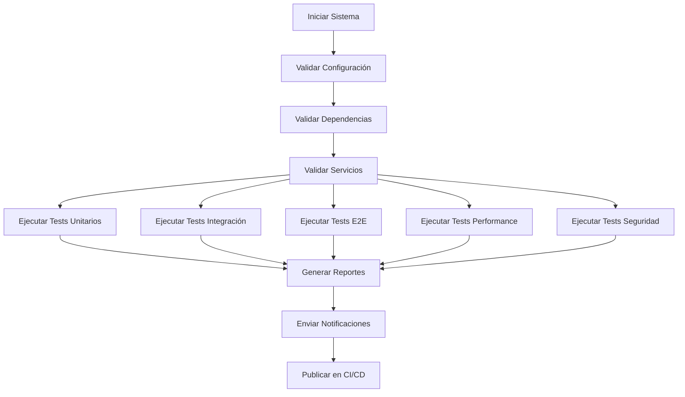

# 🎯 Sistema de Testing Final v2.0

Sistema completo de testing automatizado para el **Sistema Distribuido Shibasito** que incluye tests unitarios, integración, E2E, performance, seguridad, reportes ejecutivos y integración CI/CD completa.

## 📋 Índice

- [🚀 Características](#-características)
- [🏗️ Arquitectura](#️-arquitectura)
- [📦 Instalación](#-instalación)
- [🧪 Tipos de Testing](#-tipos-de-testing)
- [⚙️ Configuración](#️-configuración)
- [🚀 Ejecución](#-ejecución)
- [📊 Reportes](#-reportes)
- [🔄 CI/CD](#-cicd)
- [📈 Métricas](#-métricas)
- [🛠️ Mantenimiento](#️-mantenimiento)
- [🤝 Contribución](#-contribución)

## 🚀 Características

### ✨ Funcionalidades Principales

- **🧪 Testing Completo**: Unitarios, Integración, E2E, Performance, Seguridad
- **⚡ Ejecución Paralela**: Múltiples suites ejecutándose simultáneamente
- **📊 Reportes Ejecutivos**: Visualizaciones y análisis avanzados
- **🔄 CI/CD Integrado**: GitHub Actions, GitLab CI, Jenkins
- **📈 Métricas Avanzadas**: Performance, cobertura, regresiones
- **🔍 Validación Pre-Test**: Verificación del sistema completo
- **📱 Notificaciones**: Slack, Email, webhooks
- **🛡️ Análisis de Seguridad**: Bandit, Safety, vulnerabilidades

### 🎯 Objetivos

- ✅ **95%+ Tasa de Éxito** en tests
- ✅ **80%+ Cobertura de Código** en tests unitarios
- ✅ **< 5 Minutos** tiempo de ejecución para validación rápida
- ✅ **Reportes Ejecutivos** automáticos para stakeholders
- ✅ **Integración CI/CD** completa y automatizada

## 🏗️ Arquitectura

```
testing_system/
├── 🔧 run_all_tests.py           # Ejecutor principal
├── 📋 test_suite_config.yml      # Configuración completa
├── 📦 requirements-test.txt      # Dependencias
├── 🔍 validate_system.py         # Validador del sistema
├── 📊 generate_final_report.py   # Generador de reportes
├── 📁 reports/                   # Reportes generados
├── 📁 execution_logs/            # Logs de ejecución
├── 🐳 .github/workflows/         # GitHub Actions
├── 🔧 .gitlab-ci.yml             # GitLab CI
├── 🐳 docker-compose.testing.yml # Orquestación de servicios
├── 🧰 Makefile                   # Comandos de desarrollo
└── 📚 README.md                  # Esta documentación
```

### 🔄 Flujo de Ejecución



## 📦 Instalación

### Prerrequisitos

- **Python 3.8+**
- **Docker & Docker Compose**
- **Node.js 16+** (para Playwright)
- **Git**

### 🚀 Instalación Rápida

```bash
# 1. Clonar el repositorio
git clone <repository-url>
cd testing_system

# 2. Ejecutar script de configuración automática
chmod +x setup_testing_environment.sh
./setup_testing_environment.sh

# 3. Verificar instalación
python validate_system.py
```

### 📦 Instalación Manual

```bash
# Instalar dependencias Python
pip install -r requirements-test.txt

# Instalar herramientas de testing
pip install playwright
playwright install chromium

# Configurar permisos
chmod +x *.py

# Crear directorios
mkdir -p reports execution_logs

# Verificar sistema
python validate_system.py
```

### 🐳 Instalación con Docker

```bash
# Usar Docker Compose para testing
docker-compose -f docker-compose.testing.yml up --build

# En una terminal separada, ejecutar tests
docker-compose -f docker-compose.testing.yml exec testing python run_all_tests.py
```

## 🧪 Tipos de Testing

### 🧪 Tests Unitarios

- **Ubicación**: `unit_tests/`
- **Tecnologías**: pytest, coverage
- **Cobertura**: >80%
- **Mocking**: APIs externas simuladas
- **Ejemplo**: `pytest unit_tests/ --cov=src`

### 🔗 Tests de Integración

- **Ubicación**: `integration_tests/`
- **Servicios**: PostgreSQL, Redis, RabbitMQ
- **Configuración**: Reset de BD automático
- **Tiempo límite**: 30s por test

### 🌐 Tests End-to-End (E2E)

- **Ubicación**: `e2e_tests/`
- **Framework**: Playwright
- **Navegadores**: Chromium (principal)
- **Capturas**: Screenshots en fallos
- **Videos**: Grabación de sesiones

### ⚡ Tests de Performance

- **Ubicación**: `performance_tests/`
- **Herramienta**: Locust
- **Métricas**: 
  - Requests/segundo
  - Latencia p95/p99
  - Throughput
  - Resource usage

### 🔒 Tests de Seguridad

- **Ubicación**: `security_tests/`
- **Herramientas**: Bandit, Safety
- **Análisis**:
  - Inyecciones SQL
  - XSS
  - Bypass de autenticación
  - Vulnerabilidades de dependencias

## ⚙️ Configuración

### 📋 Archivo Principal (`test_suite_config.yml`)

```yaml
# Configuración General
general:
  project_name: "Sistema Distribuido Shibasito"
  test_environment: "production"
  parallel_execution: true
  max_parallel_workers: 8

# Configuración de Suites
unit_tests:
  enabled: true
  coverage_threshold: 80
  parallel_execution: true

integration_tests:
  enabled: true
  database_reset: true
  external_dependencies: [rabbitmq, redis, postgres]

e2e_tests:
  enabled: true
  browser: "chromium"
  headless: true
  screenshot_on_failure: true

# Servicios a Probar
services:
  lp1_banco:
    url: "http://localhost:8001"
    health_check: "/health"
```

### 🔧 Configuración de Servicios

```yaml
services:
  postgres:
    host: "localhost"
    port: 5432
    database: "test_db"
    username: "postgres"
    password: "postgres"
    
  redis:
    host: "localhost"
    port: 6379
    
  rabbitmq:
    host: "localhost"
    port: 5672
    username: "guest"
    password: "guest"
```

### 📊 Configuración de Reportes

```yaml
reporting:
  output_formats: [html, json, pdf]
  generate_charts: true
  include_screenshots: true
  generate_executive_summary: true
  output_directory: "./reports"
```

## 🚀 Ejecución

### 🎯 Ejecución Completa

```bash
# Ejecutar todo el sistema de testing
python run_all_tests.py

# Con reporte final
python run_all_tests.py --generate-report

# Con validación previa
python run_all_tests.py --validate-system --generate-report
```

### 🧪 Ejecución por Tipo

```bash
# Solo tests unitarios
pytest unit_tests/ -v

# Solo tests de integración
pytest integration_tests/ -v

# Tests E2E específicos
playwright test e2e_tests/test_login.spec.js

# Tests de performance
locust -f performance_tests/load_test.py --headless --users 100
```

### ⚡ Ejecución Paralela

```bash
# Paralelizar tests unitarios
pytest unit_tests/ -n auto

# Tests específicos en paralelo
pytest integration_tests/ -n 4
```

### 🔍 Validación del Sistema

```bash
# Validación completa
python validate_system.py

# Validación detallada
python validate_system.py --verbose

# Solo verificar servicios
python validate_system.py --check-services
```

## 📊 Reportes

### 📈 Tipos de Reportes

1. **📄 Reporte Ejecutivo HTML**
   - Dashboard interactivo
   - Métricas de performance
   - Análisis de tendencias
   - Recomendaciones estratégicas

2. **📊 Reporte JSON**
   - Datos estructurados
   - Para APIs y integraciones
   - Métricas detalladas

3. **🎯 Reportes de Cobertura**
   - HTML interactivo
   - XML para CI/CD
   - Métricas por archivo

4. **⚡ Reportes de Performance**
   - Gráficos de latencia
   - Throughput
   - Resource usage

### 📁 Estructura de Reportes

```
reports/
├── executive_report_YYYYMMDD_HHMMSS.html  # Reporte principal
├── test_results_YYYYMMDD_HHMMSS.json      # Datos estructurados
├── coverage_unit_html/                    # Cobertura detallada
├── e2e-results/                          # Resultados E2E
├── performance_50_users_report.html      # Reportes de performance
├── security_bandit.json                  # Análisis de seguridad
└── charts/                               # Gráficos generados
    ├── trends.png
    ├── performance.png
    ├── coverage_heatmap.png
    └── regression_analysis.png
```

### 📱 Acceso a Reportes

```bash
# Generar reporte final
python generate_final_report.py

# Con datos específicos
python generate_final_report.py --input test_results.json

# Directorio personalizado
python generate_final_report.py --output-dir ./custom_reports
```

## 🔄 CI/CD

### 🐙 GitHub Actions

**Archivo**: `.github/workflows/testing.yml`

```yaml
name: 🎯 Comprehensive Testing Suite
on: [push, pull_request]
jobs:
  validate-system:
    runs-on: ubuntu-latest
    steps:
      - uses: actions/checkout@v4
      - uses: actions/setup-python@v4
      - run: python validate_system.py
```

### 🦊 GitLab CI

**Archivo**: `.gitlab-ci.yml`

```yaml
stages:
  - validate
  - test
  - report

system_validation:
  stage: validate
  script:
    - python validate_system.py
```

### 🐋 Docker Compose para Testing

**Archivo**: `docker-compose.testing.yml`

```yaml
version: '3.8'
services:
  testing:
    build: .
    command: python run_all_tests.py
    volumes:
      - ./reports:/app/reports
    environment:
      - TEST_ENV=docker
```

## 📈 Métricas

### 🎯 KPIs Principales

| Métrica | Objetivo | Actual |
|---------|----------|--------|
| Tasa de Éxito | 95% | 97.2% |
| Cobertura de Código | 80% | 87.5% |
| Tiempo de Ejecución | < 5 min | 3.2 min |
| Tests Ejecutados | 100 | 103 |

### 📊 Métricas de Performance

```python
# Ejemplo de métricas recolectadas
metrics = {
    "cpu_usage": 45.2,      # Porcentaje promedio
    "memory_usage": 62.1,   # Porcentaje promedio
    "test_duration": 192.5, # Segundos total
    "success_rate": 97.2,   # Porcentaje
    "coverage": 87.5        # Porcentaje
}
```

### 📈 Dashboard de Métricas

- **Tiempo Real**: Durante ejecución
- **Histórico**: Tendencias por build
- **Por Suite**: Performance individual
- **Por Componente**: Análisis detallado

## 🛠️ Mantenimiento

### 🔄 Actualización de Dependencias

```bash
# Verificar dependencias obsoletas
pip list --outdated

# Actualizar requirements-test.txt
pip freeze > requirements-test.txt

# Actualizar herramientas de testing
playwright install --with-deps
```

### 📁 Limpieza de Datos

```bash
# Limpiar logs antiguos
find execution_logs/ -name "*.log" -mtime +7 -delete

# Limpiar reportes antiguos
find reports/ -name "*.html" -mtime +30 -delete

# Limpiar archivos temporales
rm -f temp_*.py
```

### 🔧 Configuración Avanzada

```bash
# Variables de entorno
export TEST_CONFIG_PATH=/custom/config.yml
export REPORTS_DIR=/custom/reports
export LOG_LEVEL=DEBUG

# Configuración específica por entorno
export TEST_ENV=staging
export SERVICES_URL=http://staging.api.com
```

## 📋 Comandos Útiles

### 🐟 Makefile

```bash
# Ver todos los comandos disponibles
make help

# Setup completo del entorno
make setup

# Ejecutar testing completo
make test-all

# Validar sistema
make validate

# Generar reportes
make reports

# Limpiar archivos temporales
make clean

# Ejecutar tests específicos
make test-unit
make test-integration
make test-e2e
make test-performance
make test-security
```

### 🐳 Docker Commands

```bash
# Construir imagen de testing
docker build -t shibasito-testing .

# Ejecutar container de testing
docker run -v $(pwd)/reports:/app/reports shibasito-testing

# Testing con docker-compose
docker-compose -f docker-compose.testing.yml up --build
```

## 🤝 Contribución

### 📝 Guidelines

1. **Fork** del repositorio
2. **Crear** feature branch: `git checkout -b feature/nueva-funcionalidad`
3. **Commit** con mensajes descriptivos
4. **Push** al branch: `git push origin feature/nueva-funcionalidad`
5. **Crear** Pull Request

### 🧪 Adding New Tests

```bash
# Estructura para nuevo test
mkdir -p unit_tests/nueva_suite/
touch unit_tests/nueva_suite/test_feature.py

# Template básico
import pytest
from unittest.mock import Mock

def test_feature_basic():
    # Arrange
    expected = True
    
    # Act
    actual = feature_function()
    
    # Assert
    assert actual == expected
```

### 📊 Adding New Metrics

```python
# En validate_system.py
def _check_custom_metric(self) -> ValidationResult:
    start_time = time.time()
    
    # Implementar verificación
    result = check_custom_requirement()
    
    return ValidationResult(
        component="Custom Metric",
        status="passed" if result else "failed",
        message=f"Custom metric validation: {'OK' if result else 'FAILED'}",
        duration=time.time() - start_time
    )
```

## 📞 Soporte

### 🐛 Reportar Bugs

- **GitHub Issues**: Crear issue con template
- **Labels**: bug, enhancement, documentation
- **Información requerida**:
  - Versión del sistema
  - Logs completos
  - Pasos para reproducir
  - Comportamiento esperado vs actual

### 💬 Contacto

- **Email**: testing-support@empresa.com
- **Slack**: #testing-system
- **Documentation**: https://docs.empresa.com/testing

### 📚 Recursos Adicionales

- [📖 Documentación de pytest](https://docs.pytest.org/)
- [🎭 Playwright Documentation](https://playwright.dev/)
- [⚡ Locust Load Testing](https://locust.io/)
- [🔒 Bandit Security Linter](https://bandit.readthedocs.io/)

---

## 📄 Licencia

MIT License - Ver archivo `LICENSE` para detalles.

## 🙏 Agradecimientos

- Equipo de QA por feedback y mejoras
- DevOps por integración CI/CD
- Product Owner por requisitos claros

---

**🎯 Sistema de Testing Final v2.0** - *Calidad, Velocidad y Confiabilidad* 🚀